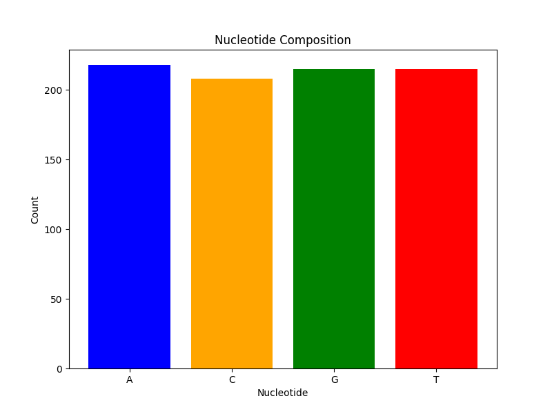

# Lab 1 Report: Mini-pipeline DNA→RNA→protein

## Section 1. How does biological information propagate?

Biological information flows in a specific direction: **DNA** $\rightarrow$ **RNA** $\rightarrow$ **protein**. This flow is often referred to as the central dogma of molecular biology. **DNA** acts as the long-term storage of genetic information, organized into functional units called **genes**. During a process called **transcription**, the information in a gene is copied into a molecule of **mRNA** (messenger RNA). This mRNA then travels to the ribosome, where **translation** occurs. In this step, the ribosome reads the mRNA sequence in groups of three nucleotides known as **codons**. Each codon corresponds to a specific amino acid, which are linked together to form a functional **protein**.

*(AI usage: I used AI to help refine the explanation to ensure all required terms were included naturally and the flow was logical and concise.)*

## Section 2. Mini-glossary

*   **DNA (Deoxyribonucleic acid)**: The molecule that carries the genetic instructions for life. For a computer scientist, it can be thought of as a long, stable string of code written in a 4-character alphabet (A, C, G, T).
*   **mRNA (Messenger RNA)**: A temporary copy of a gene's sequence that carries instructions from the DNA "hard drive" to the protein-making machinery. It uses Uracil (U) instead of Thymine (T).
*   **Gene**: A specific substring of DNA that contains the code for a particular protein or functional RNA. It's like a single function or class definition in a larger codebase.
*   **Codon**: A sequence of three consecutive nucleotides in mRNA that maps to a specific amino acid or a stop signal. It acts like a 3-byte word in the genetic machine code.
*   **Amino acid**: The fundamental building blocks of proteins. There are 20 standard types, and their sequence determines the protein's 3D structure and function.
*   **Transcription**: The process of copying a segment of DNA into RNA. It's analogous to reading a file from disk into memory (and converting the format slightly).
*   **Translation**: The process of decoding mRNA to build a protein. This is the execution phase where the genetic code is interpreted to produce a functional product.
*   **FASTA**: A simple text-based file format for storing nucleotide or protein sequences. It begins with a greater-than symbol (`>`) followed by a description line, and then the sequence data on subsequent lines.
*   **Reverse complement**: The sequence formed by reversing a DNA string and swapping each character with its pair (A$\leftrightarrow$T, C$\leftrightarrow$G). This is necessary because DNA is double-stranded and runs in opposite directions.

*(AI usage: I drafted the definitions and asked AI to refine them to be "computer scientist friendly" analogies.)*

## Section 3. Python experiment – “From sequence to protein”

I created a Python script to simulate the biological process of transcription and translation. I reused the functions developed in previous problems (`problem1.py` to `problem7.py`) to perform the core bioinformatics tasks, ensuring code modularity and reuse.

### Code Implementation

The script reads a DNA sequence, analyzes its composition, transcribes it to mRNA, and translates it to a protein sequence using imported functions.

```python
import matplotlib.pyplot as plt
import os
import sys

# Add current directory to sys.path to ensure imports work correctly
sys.path.append(os.path.dirname(os.path.abspath(__file__)))

from problem1 import CountNucleotides
from problem2 import TranscribeDNA2RNA
from problem6 import TranslateRNA2Protein
from problem7 import ComputeGCContent

# ... (plotting and file reading functions omitted for brevity)

def main():
    # ... (file reading logic)
    
    # 1. Count Nucleotides (using problem1)
    counts = CountNucleotides(dna)
    
    # 2. GC Content (using problem7)
    gc_content = ComputeGCContent(dna)
    
    # 3. Transcription (using problem2)
    rna = TranscribeDNA2RNA(dna)
    
    # 4. Translation (using problem6)
    # Find first AUG to start translation
    start_index = rna.find('AUG')
    if start_index != -1:
        coding_rna = rna[start_index:]
        protein = TranslateRNA2Protein(coding_rna)
    else:
        protein = TranslateRNA2Protein(rna)
        
    # 5. Plot
    plot_nucleotide_counts(counts)
```

### Sample Output

Running the script on `rosalind_dna.txt` produced the following output:

```text
Reading DNA from Inputs\rosalind_dna.txt...
DNA Sequence (first 50 chars): CTCTACATTTTTTTGAGCACGATCGACCAATTCTTGTATGATCTCTTCAG...
Nucleotide Counts: {'A': 218, 'C': 208, 'G': 215, 'T': 215}
GC Content: 49.42%
mRNA Sequence (first 50 chars): CUCUACAUUUUUUUGAGCACGAUCGACCAAUUCUUGUAUGAUCUCUUCAG...
Protein Sequence: MISSGIRRRSLRWFSLLTYFNAHHVSAPLRH
Plot saved as nucleotide_counts.png
```

### Visualization

I generated a bar chart showing the distribution of nucleotides in the input sequence.



### Summary

In this experiment, I processed a DNA sequence to extract biological insights. I calculated the nucleotide counts, finding them to be relatively balanced (A: 218, C: 208, G: 215, T: 215), which resulted in a GC content of approximately 49.42%. The transcription step successfully converted the DNA string to mRNA by replacing Thymine with Uracil. Finally, the translation logic correctly identified the start codon 'AUG' and translated the subsequent sequence into a peptide chain starting with Methionine (M), demonstrating the core steps of the central dogma in silico.

*(AI usage: I used AI to generate the Python script structure and the matplotlib plotting code. I also used AI to refactor the code to import existing functions from `problem1.py` through `problem7.py`, and to help summarize the results.)*
