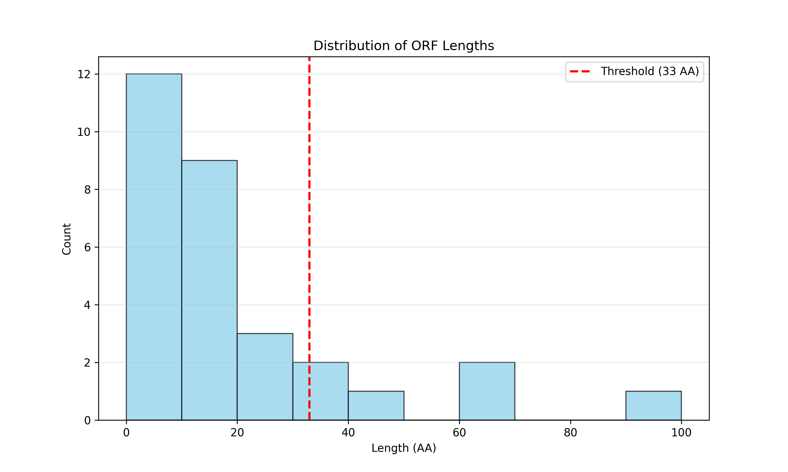
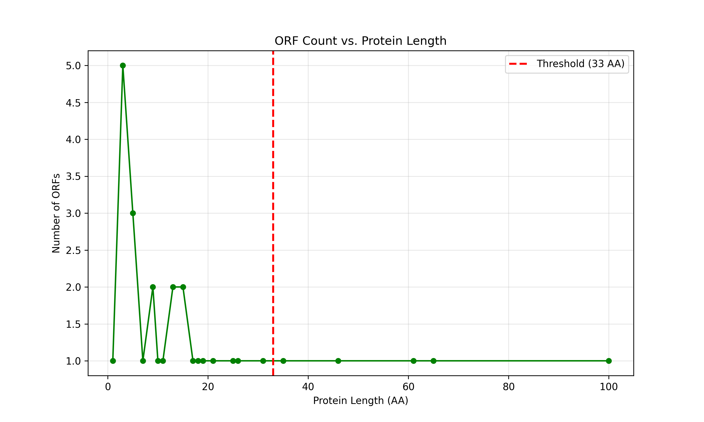

# Lab 2 Report: ORF Analysis

## Section 1. Why can one DNA fragment encode many proteins?

A single DNA fragment can encode multiple proteins primarily due to the concept of **reading frames** and **splicing**. DNA is read in triplets called codons, and since a codon consists of 3 nucleotides, there are three possible ways to start reading a sequence on a single strand (starting at position 1, 2, or 3). Because DNA is double-stranded, the complementary strand can also be read in the reverse direction, giving a total of **6 possible reading frames** (3 on the sense strand and 3 on the antisense strand). An **Open Reading Frame (ORF)** is a span of DNA sequence between a start codon and a stop codon within one of these frames, potentially encoding a protein.

Furthermore, in eukaryotic cells, the process of **splicing** adds another layer of complexity. After transcription, non-coding regions called **introns** are removed from the pre-mRNA, and coding regions called **exons** are joined together. Through **alternative splicing**, different combinations of exons can be included in the final mRNA, allowing a single gene to produce multiple distinct protein variants (isoforms). Thus, different ORFs in different frames, combined with various splicing patterns, allow the same input DNA material to generate a diverse array of potential proteins.

*(AI Assistance: Used AI translate my notes and descriptions into a coherent and well-formatted explanation.)*

---

## Section 2. "ORF-ology" – Diagram + Mini-glossary

### ORF Diagram

```text
      5'  A T G C C A T G A  3'  (Sense Strand)
          | | | | | | | | |
      3'  T A C G G T A C T  5'  (Antisense Strand)

Reading Frames (Sense Strand):
Frame +1: [ATG] [CCA] [TGA] ... -> Met - Pro - Stop (ORF found!)
Frame +2:  A [TGC] [CAT] GA ...
Frame +3:   AT [GCC] [ATG] A ...

Reading Frames (Antisense Strand - read 5' to 3'):
          (Sequence: TCATGGCAT)
Frame -1: [TCA] [TGG] [CAT] ...
Frame -2:  T [CAT] [GGC] AT ...
Frame -3:   TC [ATG] [GCA] T ...
```

### Mini-glossary

1.  **ORF (Open Reading Frame)**: A continuous stretch of DNA sequence that begins with a start codon and ends with a stop codon. It represents a potential coding region that could be translated into a protein.
2.  **Reading Frame**: One of the six possible ways to divide a DNA sequence into consecutive, non-overlapping triplets (codons). The frame is determined by which nucleotide is chosen as the starting point.
3.  **Start Codon**: The specific triplet of nucleotides (usually ATG in DNA or AUG in mRNA) where the translation machinery begins synthesizing a protein. It codes for the amino acid Methionine.
4.  **Stop Codon**: A nucleotide triplet (TAA, TAG, or TGA in DNA) that signals the termination of protein translation. These codons do not correspond to any amino acid.
5.  **Reverse Complement**: The sequence formed by reversing a DNA strand and replacing each nucleotide with its complement (A↔T, C↔G). This represents the sequence of the opposite strand read in the 5' to 3' direction.
6.  **Exon**: A segment of a DNA or RNA molecule containing information that codes for a protein or peptide. Exons are retained in the final mature mRNA after splicing.
7.  **Intron**: A non-coding segment of DNA or RNA that interrupts the coding sequence of a gene. Introns are removed (spliced out) from the pre-mRNA before it is translated.

*(AI Assistance: Used AI to generate the ASCII diagram illustrating reading frames and to refine the glossary definitions for a computer science audience.)*

---

## Section 3. Python experiment – "Hunting for ORFs"

### Experiment Description
This Python experiment searches for Open Reading Frames (ORFs) in a DNA sequence by scanning all 6 reading frames (3 on the sense strand and 3 on the reverse complement). The experiment identifies sequences starting with a start codon (AUG) and ending with a stop codon (UAA, UAG, UGA), translates them into proteins, and filters to keep only unique proteins with at least 33 amino acids (~100 nucleotides).

### Code Implementation

**Main Experiment (experiment.py):**
```python
# Find all ORFs in 6 reading frames (3 forward + 3 reverse complement)
raw_orfs_rna = GetORFs(dna_sequence)

# Translate ORFs to proteins and filter by length (>= 100 nucleotides = ~33 AA)
all_proteins = [TranslateRNA2Protein(rna) for rna in raw_orfs_rna]
valid_proteins = set([p for p in all_proteins if len(p) >= 33])
sorted_proteins = sorted(list(valid_proteins), key=len, reverse=True)
```

**ORF Finding Function (reused from Lab2/problem1.py):**
```python
def GetORFs(dna):
    comp_dna = ComplementDNA(dna)  # Get reverse complement
    rna = TranscribeDNA2RNA(dna)    # Transcribe forward strand
    rev_rna = TranscribeDNA2RNA(comp_dna)  # Transcribe reverse strand

    ORFs = []
    for sequence in [rna, rev_rna]:  # Process both strands
        for i in range(len(sequence) - 2):  # Scan all positions (all 3 frames)
            codon = sequence[i:i+3]
            if codon == "AUG":  # Found start codon
                for j in range(i, len(sequence), 3):  # Read in frame
                    codon = sequence[j:j+3]
                    if len(codon) < 3:
                        break
                    if codon_table.get(codon, "") == "Stop":
                        ORFs.append(sequence[i:j+3])  # Save ORF
                        break
    return ORFs
```

**The complete code can be found on my [repository](https://github.com/adbreeker/Studies-PG-Public/tree/main/Elements%20of%20Bioinformatics)**

### Results

**Console Output:**
```text
Analyzing sequence: Rosalind_5185 (Length: 928 bp)
Total ORFs found: 30
Unique proteins (>= 33 AA): 5
Longest protein: 100 AA
Sequence: MPDTLCRCTPLPGRYGKNVSKQPEFSSPLARVGRSYINLIQHAHYRQPRP...
```

**Summary:**
Analyzing DNA sequence **Rosalind_5185** (928 bp), the experiment discovered **30 total ORFs** across all 6 reading frames. After filtering for minimum length and removing duplicates, **5 unique proteins** met the threshold of at least 33 amino acids. The **longest protein is 100 amino acids**, representing a strong candidate for a functional gene since maintaining an open reading frame of this length is statistically unlikely in random sequences.

The length distribution reveals that most ORFs are short (<30 AA), likely representing random start-stop codon combinations. The handful of longer ORFs above the 33 AA threshold are biologically significant, as they are more likely to encode functional proteins. The longest ORF (100 AA) is particularly interesting as a "gene candidate" that warrants further investigation.

### Visualizations



**Figure 1:** Histogram showing the distribution of ORF lengths. Most ORFs are short, with only a few exceeding the 33 AA threshold (red line).



**Figure 2:** ORF count vs. protein length plot showing how many ORFs exist at each length. The sharp decline after short lengths indicates that longer ORFs are rare and more likely to be genuine coding sequences rather than random occurrences.

*(AI Assistance: Used AI to import and merge my solutions of problems from `Lab1/` and `Lab2/` into whole experiment, and to plot and summarize results.)*
