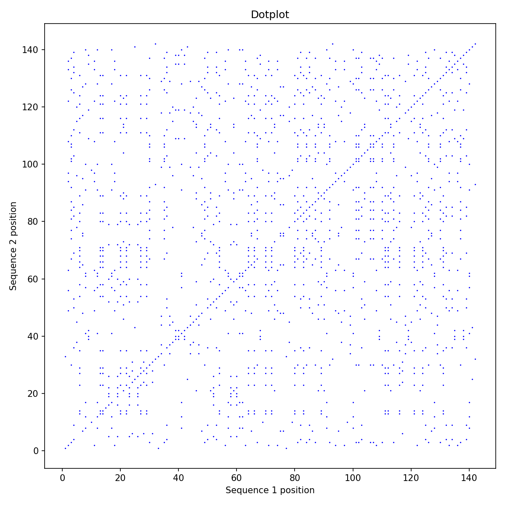
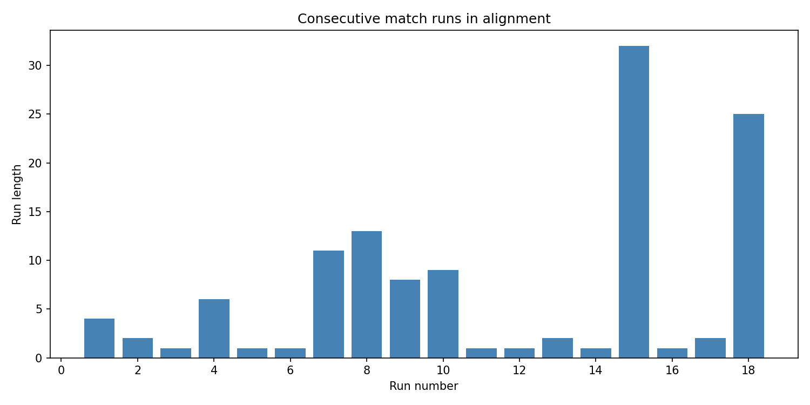
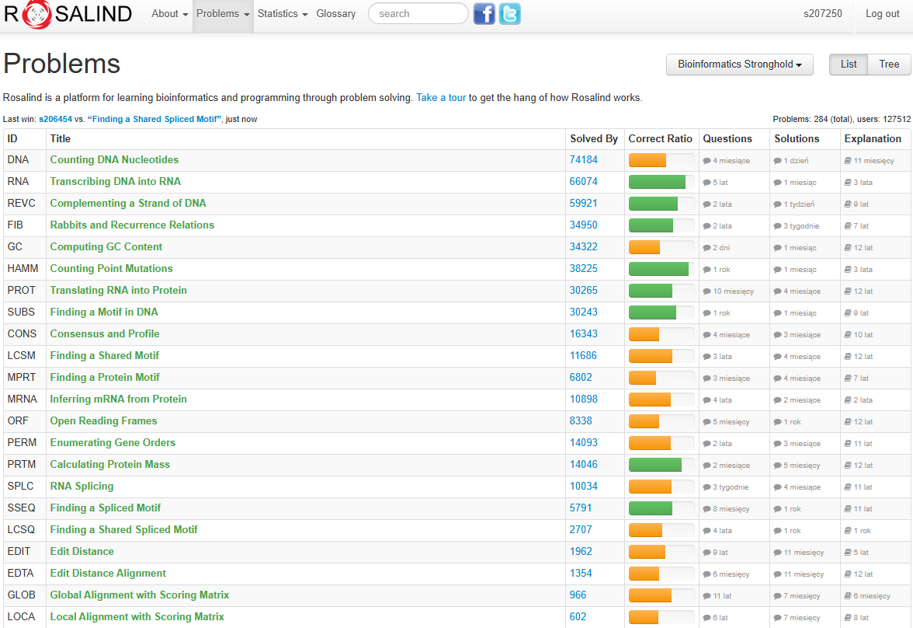

# Lab 3 Report: Sequence Alignment

## Section 1. How do we measure sequence similarity?

To measure how similar two biological sequences are, we align them to maximize the correspondence between their residues. **Global alignment** (Needleman-Wunsch) forces the alignment to span the entire length of both sequences, which is ideal for comparing homologous genes of similar size. In contrast, **local alignment** (Smith-Waterman) searches for the highest-scoring regions within the sequences, making it better for finding conserved domains or motifs in otherwise divergent sequences. **Edit distance** is a basic metric that counts the minimum number of operations (insertions, deletions, substitutions) to transform one sequence into another; it fits into the **dynamic programming (DP)** framework as a cost-minimization problem. In practice, we use **substitution matrices** (like BLOSUM62) to score amino acid changes based on evolutionary probability, and **gap penalties** to account for insertions and deletions. Because full DP algorithms have quadratic time complexity ($O(n^2)$), they are too slow for searching massive databases (like GenBank), so heuristics like **BLAST** are used to quickly find high-scoring seed matches and extend them.

*(AI usage: I used AI to summarize the differences between global and local alignment and to explain the role of heuristics in database searching.)*

---

## Section 2. Mini-glossary

1.  **Global Alignment**: A method that aligns two sequences from start to finish. It is computed using dynamic programming (e.g., Needleman-Wunsch) to find the optimal path through a scoring matrix. It is used when comparing two sequences that are expected to be similar across their entire length, such as orthologous proteins.
2.  **Local Alignment**: An alignment strategy that identifies the most similar subsequences between two inputs. It is computed using the Smith-Waterman algorithm, which allows the alignment score to reset to zero if it becomes negative. This is essential for finding conserved functional domains in proteins that otherwise differ.
3.  **Edit Distance**: A measure of dissimilarity defined as the minimum number of operations (insertions, deletions, substitutions) needed to convert one string into another. It is computed using a specific DP recurrence. Computer scientists use it for string matching and spell checking; bioinformaticians use it as a baseline for sequence divergence.
4.  **Substitution Matrix**: A table (e.g., BLOSUM, PAM) that assigns a score to every possible pair of aligned residues. It is computed from statistical analysis of confirmed alignments. It ensures that biologically likely substitutions (conservative mutations) are penalized less than unlikely ones.
5.  **Gap Penalty**: A negative score applied when a gap is introduced in an alignment. It is often implemented as an "affine" penalty (high cost to open, low cost to extend). This models the biological reality that a single event can insert or delete multiple nucleotides.
6.  **Dotplot**: A 2D visualization where one sequence is on the X-axis and the other on the Y-axis, with dots placed at matching coordinates. It is computed by iterating through both sequences and marking matches. It allows for rapid visual identification of diagonal runs (similarity), repeats, and structural rearrangements.
7.  **Homology**: The relationship of sharing a common ancestor. It is not a measure of similarity itself but is *inferred* from high sequence identity or similarity scores. It is the fundamental concept allowing us to predict the function of a new gene based on a known related gene.

*(AI usage: I asked AI to provide "computer scientist friendly" definitions for these bioinformatics terms.)*

---

## Section 3. Python experiment – “Comparing two FASTA sequences”

### Experiment Description
In this experiment, I compared the Hemoglobin Alpha subunit protein sequences from **Human** (*Homo sapiens*) and **Mouse** (*Mus musculus*). These proteins are expected to be highly conserved due to their critical role in oxygen transport. I implemented a script to perform a **Global Alignment** using the BLOSUM62 substitution matrix, calculate alignment statistics (identity, gaps), and visualize the similarity using a dotplot and a match-run chart.

### Code Implementation

The script loads the sequences, performs global alignment using a dynamic programming approach (imported from `problem6_GLOB.py`), and computes statistics.

```python
import os
import sys
import matplotlib.pyplot as plt
from Bio.Align import substitution_matrices

# Import custom alignment function
sys.path.append(os.path.dirname(os.path.dirname(os.path.abspath(__file__))))
from Lab3.problem6_GLOB import GlobalAlignment, GlobalAlignmentCost
from Lab1.problem7_GC import GetFASTASequences

def ComputeAlignmentStats(align1, align2):
    """Compute alignment statistics"""
    length = len(align1)
    identical = sum(1 for i in range(length) if align1[i] == align2[i] and align1[i] != '-')
    gaps = sum(1 for i in range(length) if align1[i] == '-' or align2[i] == '-')
    
    # Count gap regions (consecutive gaps count as 1 region)
    gap_count = 0
    in_gap = False
    for i in range(length):
        if align1[i] == '-' or align2[i] == '-':
            if not in_gap:
                gap_count += 1
                in_gap = True
        else:
            in_gap = False
    
    return length, identical, 100.0 * identical / length, gap_count, gaps

def GetInterpretation(identity):
    if identity >= 90: return "Very high similarity - likely orthologs/recent duplicates"
    if identity >= 70: return "High similarity - likely homologs with conserved function"
    if identity >= 40: return "Moderate similarity - possible distant homologs"
    if identity >= 25: return "Low similarity - structural similarity possible"
    return "Very low similarity - relationship uncertain"

# ... (Plotting functions omitted for brevity)

if __name__ == '__main__':
    # Load sequences (Human vs Mouse Hemoglobin Alpha)
    # ... (Data loading code)
    
    # Global Alignment
    scoring_matrix = substitution_matrices.load("BLOSUM62")
    score = GlobalAlignmentCost(seq1.sequence, seq2.sequence, scoring_matrix, gap_penalty=10)
    align1, align2 = GlobalAlignment(seq1.sequence, seq2.sequence, scoring_matrix, gap_penalty=10)
    
    # Statistics
    length, identical, identity, gap_count, gap_length = ComputeAlignmentStats(align1, align2)
    print(f"Score: {score} | Length: {length} | Identity: {identical} ({identity:.2f}%)")
    
    # Interpretation
    print(f"Interpretation: {identity:.1f}% identity = {GetInterpretation(identity)}")
    
    # Visualization
    CreateDotplot(seq1.sequence, seq2.sequence)
```

### Imported Functions

**GlobalAlignment (from problem6_GLOB.py)**
This function implements the Needleman-Wunsch algorithm with a linear gap penalty.

```python
def GlobalAlignment(seq1, seq2, scoring_matrix, gap_penalty=5):
    n = len(seq1)
    m = len(seq2)
    dp = [[0] * (m + 1) for _ in range(n + 1)]

    # Initialization and DP table filling (omitted for brevity)
    # ...

    # Backtracking to reconstruct alignment
    align1 = ""
    align2 = ""
    i, j = n, m
    while i > 0 or j > 0:
        if i > 0 and j > 0 and dp[i][j] == dp[i - 1][j - 1] + scoring_matrix[seq1[i - 1]][seq2[j - 1]]:
            align1 = seq1[i - 1] + align1
            align2 = seq2[j - 1] + align2
            i -= 1
            j -= 1
        elif i > 0 and (j == 0 or dp[i][j] == dp[i - 1][j] - gap_penalty):
            align1 = seq1[i - 1] + align1
            align2 = "-" + align2
            i -= 1
        else:
            align1 = "-" + align1
            align2 = seq2[j - 1] + align2
            j -= 1
    return align1, align2
```

**The complete code can be found on my [repository](https://github.com/adbreeker/Studies-PG-Public/tree/main/Elements%20of%20Bioinformatics)**

### Results

The comparison of Human and Mouse Hemoglobin Alpha yielded the following results:

```text
Seq1: HBA_HUMAN (142 AA): MVLSPADKTNVKAAWGKVGAHAGEYGAEAL...
Seq2: HBA_MOUSE (142 AA): MVLSGEDKSNIKAAWGKIGGHGAEYGAEAL...

Score: 642 | Length: 142 | Identity: 121 (85.21%)
Gaps: 0 regions, 0 total positions

Alignment (first 60 positions):
Seq1 MVLSPADKTNVKAAWGKVGAHAGEYGAEALERMFLSFPTTKTYFPHFDLSHGSAQVKGHG
||||  || | |||||| | |  ||||||||||| ||||||||||||| |||||||| ||
MVLSGEDKSNIKAAWGKIGGHGAEYGAEALERMFASFPTTKTYFPHFDVSHGSAQVKAHG
Seq2

Interpretation: 85.2% identity = High similarity - likely homologs with conserved function
Plots saved to Images/
```

### Visualization

I generated a dotplot to visualize the alignment. The clear, unbroken diagonal line indicates a high degree of similarity with no major insertions or deletions.



I also plotted the lengths of consecutive matching runs. The presence of long runs (e.g., >20 residues) confirms that large portions of the protein structure are perfectly conserved.



### Summary

The experiment confirms that Human and Mouse Hemoglobin Alpha are **highly homologous**, sharing **85.21% identity** over their entire length. The alignment required **zero gaps**, indicating that the structure of this protein has been rigidly preserved during the evolutionary divergence of primates and rodents. The high alignment score (642) and long runs of identical amino acids suggest that these proteins perform the exact same function (oxygen transport) in both species.

*(AI usage: I used AI to plot results of experiment created via merging previous solutions, and to interpret the biological significance of the alignment score.)*

---

## Section 4. Rosalind validation

I've passed all 7 problems from Lab3 on Rosalind
- 6 default problems:
    - [LCSM](https://rosalind.info/problems/lcsm/) – Finding a Shared Motif
    - [LCSQ](https://rosalind.info/problems/lcsq/) – Finding a Shared Spliced Motif
    - [EDIT](https://rosalind.info/problems/edit/) – Edit Distance
    - [EDTA](https://rosalind.info/problems/edta/) – Edit Distance Alignment
    - [PERM](https://rosalind.info/problems/perm/) – Enumerating Gene Orders
    - [GLOB](https://rosalind.info/problems/glob/) – Global Alignment with Scoring Matrix
- 1 bonus problem:
    - [LOCA](https://rosalind.info/problems/loca/) – Local Alignment with Scoring Matrix


