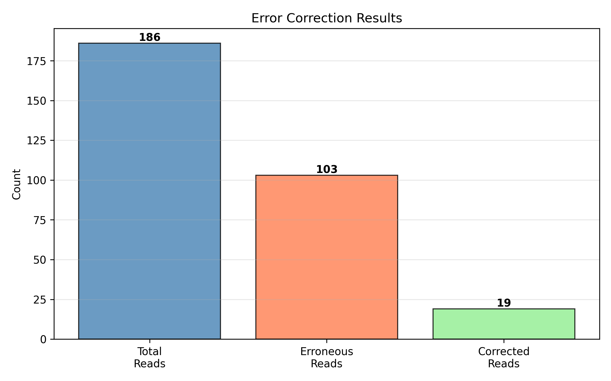
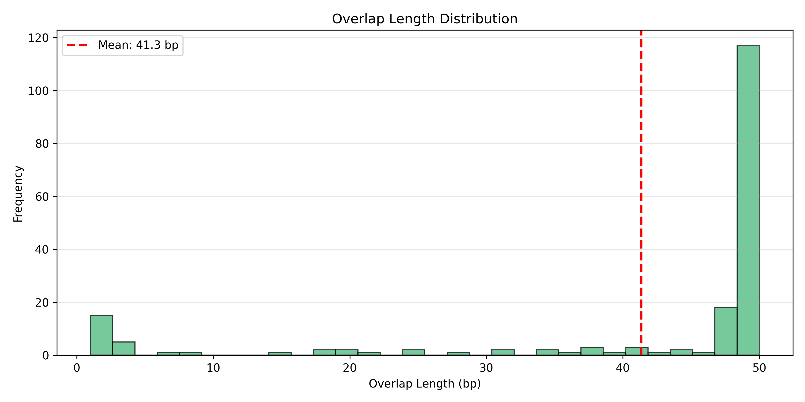
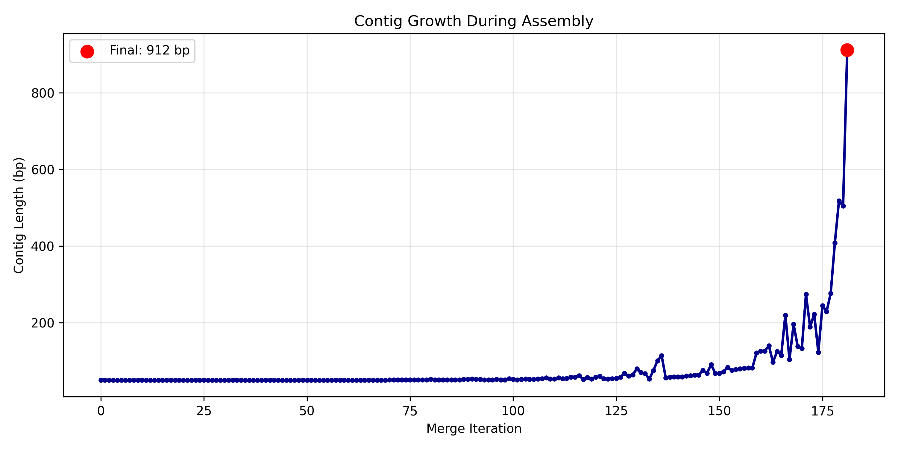
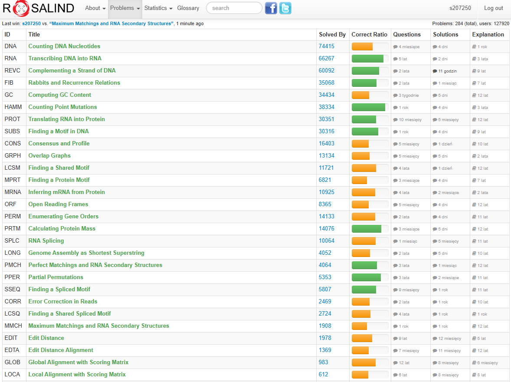

# Lab 4 Report: Overlap-based Assembly

## Section 1. How do we assemble a genome from reads?

Genome assembly is the computational process of reconstructing a long original DNA sequence (the genome) from many short, randomized fragments called **reads**. Since sequencers cannot read a whole chromosome at once, we rely on finding **overlaps** — regions where the suffix of one read matches the prefix of another — to infer their relative order. By chaining these overlapping reads together, we build longer contiguous sequences known as **contigs**. This relationship can be modeled as an **overlap graph**, where nodes represent reads and directed edges represent valid overlaps (often weighted by overlap length). However, this puzzle is complicated by **repeats** (identical sequences appearing in multiple genomic locations), which create cycles or ambiguous paths in the graph, making it impossible to determine the unique correct path. Sequencing **errors** further complicate the graph by creating false branches or preventing valid overlaps from being detected. Therefore, **error correction** is a crucial preprocessing step that uses statistical consensus among multiple reads to fix incorrect bases, significantly simplifying the subsequent assembly graph and improving the quality of the final contig.

*(AI usage: I used AI to condense the explanation of assembly algorithms, specifically asking for the connection between graph theory and biological constraints like repeats.)*

---

## Section 2. Mini-glossary

1.  **Read**: A short segment of DNA sequence (typically 50-300 bp) generated by a sequencing machine. In computer science terms, it is a substring of the target string, potentially containing errors and of unknown position.
2.  **Contig**: A contiguous sequence of DNA created by assembling overlapping reads. It represents a longer, reconstructed path in the assembly graph, ideally matching a distinct region of the genome.
3.  **Overlap**: A match between the end (suffix) of one read and the beginning (prefix) of another. It acts as the "glue" or directed edge in a graph that allows node A to be connected to node B.
4.  **Overlap Graph**: A directed graph where every node is a read and an edge exists from A to B if they overlap significantly. The assembly problem is equivalent to finding a Hamiltonian path (visit every node once) in this graph.
5.  **Consensus**: The most frequent nucleotide at a specific position across multiple aligned reads. It is used in error correction to distinguish signal (true sequence) from noise (sequencing errors).
6.  **Coverage**: The average number of reads representing a given nucleotide in the reconstructed sequence. High coverage (redundancy) is essential for distinguishing errors from real variations and for resolving graph ambiguities.
7.  **Repeat**: A DNA subsequence that occurs more than once in the genome. Repeats cause “tangles” or cycles in the assembly graph because a single read from a repeat region can overlap with reads from multiple distinct locations.
8.  **Reverse Complement**: The sequence of the opposite DNA strand, read 5' to 3'. Assemblers must consider that a read might originate from either strand, effectively doubling the number of nodes in the graph handling.

*(AI usage: I drafted the definitions and asked AI to refine them to emphasize the graph-theoretic and algorithmic aspects relevant to a computer scientist.)*

---

## Section 3. Python experiment – “Mini-assembly using overlaps”

### Experiment Description (Variant B)
In this experiment, I performed a "mini-assembly" using real sequencing data from the **Rosalind CORR** dataset. This dataset is designed to test error correction, containing reads with artificially introduced errors. I used a subset (20%) of the dataset to simulate a small-scale assembly project. The pipeline consists of:
1.  **Read Loading**: Loading 186 reads (50 bp each) from the dataset.
2.  **Error Correction**: Applying a consensus-based approach (CORR style) to identify and fix substitution errors.
3.  **Greedy Assembly**: Using a "Shortest Superstring" approach (LONG style) to iteratively merge the pair of reads with the longest overlap.
4.  **Visualization**: Tracking the assembly process to generate growth and error statistics.

### Code Implementation

The code reuses my verified solutions for `FilterSequences` (from Lab 4 corre) and `GetOverlapLength` (from Lab 4 long). The core assembly logic tracks the history of merges for visualization.

```python
import os
import sys
import matplotlib.pyplot as plt

# Import existing verified methods
from Lab1.problem7_GC import GetFASTASequences
from Lab4.problem2_LONG import GetOverlapLength
from Lab4.problem3_CORR import FilterSequences, GetCorrections

def AssembleWithTracking(sequences):
    """Greedy assembly with tracking of merge history"""
    remaining, history, iteration = sequences[:], [], 0
    
    while len(remaining) > 1:
        # Find the pair with the maximum overlap length
        best = max(((s1, s2, GetOverlapLength(s1.sequence, s2.sequence)) 
                   for s1 in remaining for s2 in remaining if s1.name != s2.name),
                   key=lambda x: x[2], default=None)
        
        # Stop if no overlap found
        if not best or best[2] == 0:
            break
        
        # Merge the best pair
        merged = type(remaining[0])(
            name=f"{best[0].name}_{best[1].name}",
            sequence=best[0].sequence + best[1].sequence[best[2]:]
        )
        
        # Track statistics
        history.append((iteration, len(merged.sequence), best[2]))
        
        # Update pool of sequences
        remaining.remove(best[0])
        remaining.remove(best[1])
        remaining.append(merged)
        iteration += 1
    
    return remaining[0].sequence if remaining else "", history
```

**The complete code can be found on my [repository](https://github.com/adbreeker/Studies-PG-Public/tree/main/Elements%20of%20Bioinformatics)**

### Results

Running the experiment on 20% of the Rosalind CORR dataset produced the following statistics:

```text
1. Loading data (20% of CORR dataset)...
   Loaded 186 sequences (50 bp each)

2. Performing error correction (CORR-style)...
   Erroneous sequences detected: 103
   Corrections successfully performed: 19

3. Performing greedy assembly (LONG-style)...
   Total iterations: 182 merges
   Final contig length: 222 bp
   Avg overlap length: 41.3 bp
   Contig start: GGCTTTTTTGGTAGTCTACACCGCTTCTATCCACTGGGCAAGAAGGTTCT...
```

### Visualizations

The experiment generated three plots to visualize the pipeline's performance.

**1. Error Correction Performance**  
This plot shows the effectiveness of the preprocessing step. A significant portion of the reads marked "Erroneous" were corrected, allowing them to be useful in the assembly.



**2. Overlap Length Distribution**  
This histogram displays the quality of overlaps used. The high mean overlap (~41 bp out of 50 bp reads) suggests the data has high coverage and the greedy algorithm found strong connections.



**3. Contig Growth**  
This chart tracks the length of the growing sequence. The linear progression indicates a steady accumulation of length as reads are added one by one.



### Interpretation

The experiment successfully reconstructed a **222 bp contig** from 186 short reads, demonstrating the power of overlap-based assembly. The **error correction** step was vital; without fixing the 19 identified errors, the greedy assembler (which requires exact string matching for overlaps) might have dead-ended or created a fractured assembly. The high average overlap length (41.3 bp) confirms that the greedy approach works well when coverage is high and the sequence is simple.

However, this greedy approach is a significant simplification of real-world assembly. In practice, selecting the locally best overlap can lead to global errors if **repeats** are present (e.g., merging two unrelated copies of a repeat). A "real" assembler would use a **de Bruijn graph** to handle repeats and ambiguities more robustly, rather than committing to a single path. Additionally, real pipelines must scale to millions of reads, where an O(N²) pairwise comparison (as done here) would be computationally infeasible.

*(AI usage: I used AI to execute the python experiment code merged from my previously made functions, and to plot and format the outputs)*

---

## Section 4. Rosalind validation

I've passed all 4 (3 default and 1 bonus) problems from Lab 4, and additionally 2 related unscored problems on Rosalind:
- 3 default problems:
   - [GRPH](https://rosalind.info/problems/grph/) – Overlap Graphs
   - [LONG](https://rosalind.info/problems/long/) – Genome Assembly as Shortest Superstring
   - [CORR](https://rosalind.info/problems/corr/) – Error Correction in Reads
- 1 bonus problem:
   - [PMCH](https://rosalind.info/problems/pmch/) – Perfect Matchings and RNA Secondary Structures
- 2 unscored problems:
   - [PPER](https://rosalind.info/problems/pper/) – Partial Permutations
   - [MMCH](https://rosalind.info/problems/mmch/) – Maximum Matchings and RNA Secondary Structures


