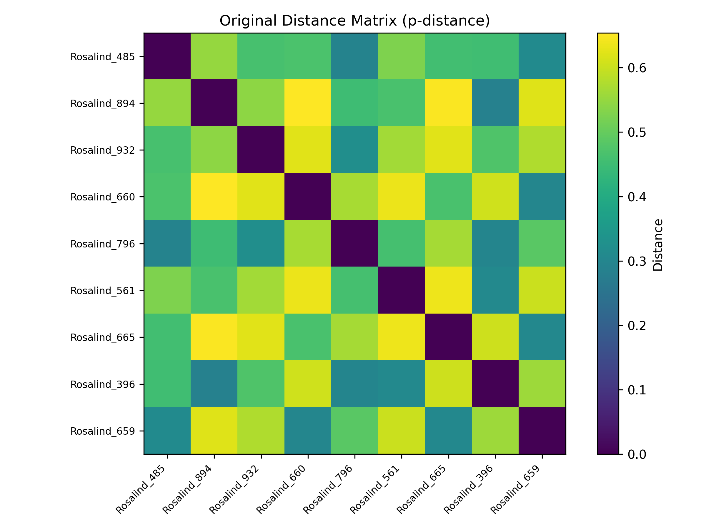
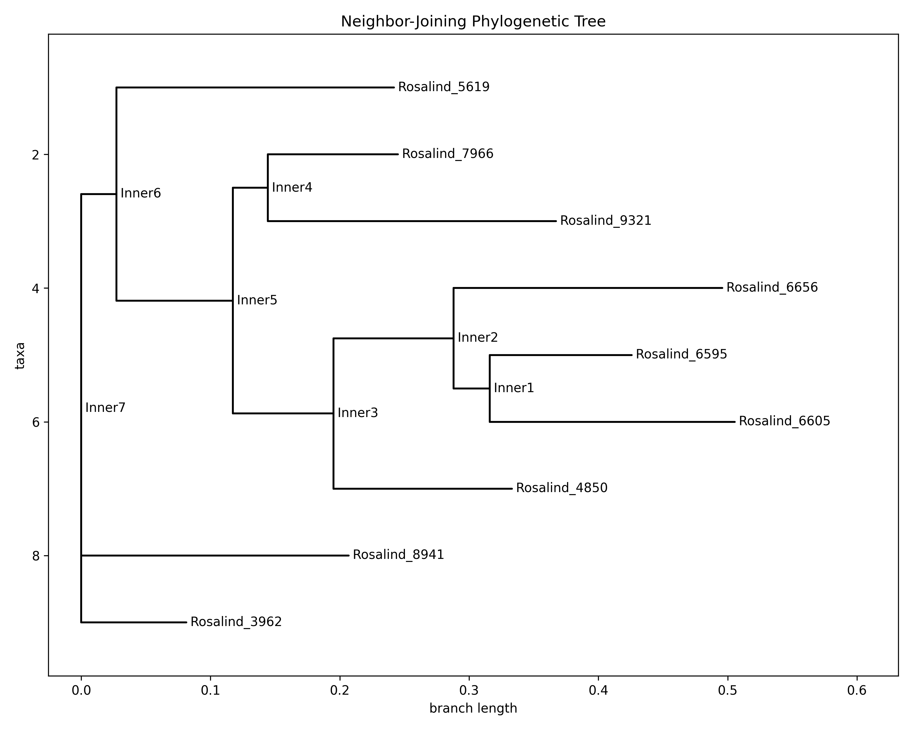

# Lab 5 Report: Phylogeny from Distances and Newick Trees

## Section 1. How do we reconstruct evolutionary history?

Reconstructing evolutionary history involves inferring the branching relationships between species, often visualized as a **phylogenetic tree**, where leaves represent current taxa and internal nodes represent common ancestors. This process typically starts with a **distance matrix**, which quantifies the genetic divergence (e.g., proportion of differing nucleotides) between every pair of species. If the input distances are perfectly **additive**, they can be mapped exactly to a tree where the distance between any two leaves equals the sum of edge weights along the path connecting them; however, real biological data is usually noisy and non-additive due to varying rates of evolution, homoplasy (convergent mutations), and measurement errors, requiring **heuristics** like Least Squares or Neighbor-Joining to find the "best fit" tree that minimizes the discrepancy between the tree distances and the observed data. The structure of these trees, including edge weights representing evolutionary time or change, is commonly serialized using the **Newick format**, a compact parenthetic notation like `(A:0.1,B:0.2):0.5;` that can be parsed recursively. Because different algorithms or data subsets can produce different topologies for the same taxa, we compare trees using metrics like **split distance** (Robinson-Foulds) to measure how many evolutionary groupings (bipartitions) differ between two models. Ultimately, these computational tools allow us to trace the lineage of species back to their Lowest Common Ancestor (LCA), turning raw pairwise dissimilarities into a structured historical narrative of how life diversified.

*(AI usage: I used AI to synthesize the concepts of additivity, heuristics, and tree reconstruction into a cohesive paragraph, ensuring all required keywords were integrated logically and the explanation flows naturally.)*

---

## Section 2. Mini-glossary

1.  **Phylogenetic Tree**: A directed acyclic graph (typically a binary tree) that models the evolutionary relationships among a set of organisms. For a computer scientist, it is a hierarchical clustering where leaves are data points (taxa) and the topology represents the order of divergence events, with edge weights capturing evolutionary distance.
2.  **Distance Matrix**: A symmetric N×N matrix where entry (i, j) represents the pairwise dissimilarity between taxon i and taxon j, typically measured as the proportion of differing sites in aligned sequences. In phylogeny, this acts as the input to tree-building algorithms, analogous to an adjacency matrix for a weighted complete graph.
3.  **Additive Metric**: A property of a distance matrix where the distance between any two leaves equals the sum of the edge weights along the unique path connecting them in the tree. Real-world data is rarely perfectly additive due to evolutionary complexities, turning tree reconstruction into an optimization problem of finding the closest additive approximation.
4.  **Newick Format**: A standardized text-based serialization format for trees using nested parentheses (e.g., `((A:1,B:2):3,C:4);`) to encode both topology and optional branch lengths. It is the "JSON of phylogenetics," efficiently encoding tree structure in a way that is easily parsable by recursive descent algorithms.
5.  **Neighbor-Joining (NJ)**: A greedy agglomerative clustering algorithm that builds a tree by iteratively joining the pair of nodes that minimizes the total branch length, using a criterion that accounts for average distances to other nodes. Unlike UPGMA, it does not assume a constant molecular clock (uniform evolutionary rate), making it robust for most biological datasets where evolution proceeds at varying speeds.
6.  **Least Squares Error**: An objective function measuring the sum of squared differences between the observed distances in the matrix and the path lengths in the reconstructed tree. Minimizing this error is a way to gauge how well the tree model fits the raw data, similar to fitting a regression line to scattered points in statistics.
7.  **LCA (Lowest Common Ancestor)**: The deepest node in the tree that is an ancestor to a given set of leaves, representing the most recent evolutionary point where the lineages shared a single population. In tree algorithms, finding the LCA is a fundamental operation (solvable in O(log n) time with preprocessing) used for computing distances and answering phylogenetic queries.

*(AI usage: I asked AI to provide definitions that bridge the gap between biological concepts and their graph-theory or algorithmic equivalents used in computer science, ensuring each term is explained in 2-3 sentences with relevance to phylogeny.)*

---

## Section 3. Python experiment – "Building and analyzing a phylogenetic tree"

### Experiment Description (Variant A)
In this experiment, I implemented a pipeline to reconstruct a phylogenetic tree from raw DNA sequences. The process involves:
1.  **Data Loading**: Reading FASTA sequences from the Rosalind PDST dataset.
2.  **Distance Calculation**: Computing the p-distance (proportion of different nucleotides) for all pairs to build a distance matrix.
3.  **Tree Reconstruction**: Using the **Neighbor-Joining (NJ)** algorithm to build a tree from the distance matrix. I chose NJ over UPGMA because it does not assume a constant rate of evolution (molecular clock), which is more realistic for real biological data where different lineages evolve at different speeds.
4.  **Validation**: Computing the path lengths in the generated tree and comparing them back to the original matrix using Least Squares error (MSE) to quantify the loss of information during tree reconstruction.
5.  **Visualization**: Generating a heatmap of the distance matrix and a visual representation of the reconstructed tree.

### Code Implementation

The experiment reuses my implementation for calculating p-distances (`CreateDistanceMatrix` from `problem3_PDST.py`) and uses `Bio.Phylo` for tree construction and visualization.

```python
import os
import sys
import numpy as np
import matplotlib.pyplot as plt
from Bio import Phylo
from Bio.Phylo.TreeConstruction import DistanceTreeConstructor, DistanceMatrix

# Import custom functions from previous labs
sys.path.append(os.path.dirname(os.path.dirname(os.path.abspath(__file__))))
from Lab1.problem7_GC import GetFASTASequences
from Lab5.problem3_PDST import CreateDistanceMatrix

def BuildNJTree(names, dist_matrix):
    """Build Neighbor-Joining tree from distance matrix.
    NJ chosen over UPGMA: doesn't assume molecular clock."""
    lower_triangular = []
    # BioPython requires a lower triangular matrix for input
    for i in range(len(dist_matrix)):
        lower_triangular.append([dist_matrix[i][j] for j in range(i + 1)])
    
    dm = DistanceMatrix(names, lower_triangular)
    constructor = DistanceTreeConstructor()
    return constructor.nj(dm)  # Build tree using Neighbor-Joining

def GetTreeDistanceMatrix(tree, names):
    """Extract pairwise distances from reconstructed tree."""
    n = len(names)
    tree_dists = [[0.0] * n for _ in range(n)]
    
    # For each pair of taxa, compute the distance in the tree
    for i, name_i in enumerate(names):
        for j, name_j in enumerate(names):
            if i != j:
                tree_dists[i][j] = tree.distance(name_i, name_j)
    return tree_dists

def ComputeLeastSquaresError(original, reconstructed):
    """Compute L2 (Least Squares) error between matrices."""
    total = sum((original[i][j] - reconstructed[i][j]) ** 2 
                for i in range(len(original)) for j in range(len(original)))
    mse = total / (len(original) ** 2)
    return total, mse
```

**The complete code can be found on my [repository](https://github.com/adbreeker/Studies-PG-Public/tree/main/Elements%20of%20Bioinformatics)**

I understand that the code essentially acts as a lossy compressor: it takes O(N²) pairwise distances and attempts to compress them into O(N) edges of a tree. The `DistanceTreeConstructor` performs the logic of finding the pair of nodes that are close to each other but far from the rest of the tree (the NJ criterion) to iteratively build this structure. The Least Squares error quantifies how much information is lost in this compression, with lower error indicating better fit.

### Data Description

The experiment used sequences from the **Rosalind PDST dataset**, which contains DNA sequences from different taxa. I limited the analysis to 9 sequences (each 971 bp long) for clear visualization, as larger trees become difficult to interpret visually. The sequences represent genetic material that has diverged over evolutionary time, with the p-distance measuring the proportion of positions that differ between any two sequences.

### Results

The pipeline successfully processed the sequences and reconstructed the evolutionary history:

```text
1. Loading sequences...
   Loaded 9 sequences (971 bp each)

2. Computing distance matrix (p-distance)...
   Matrix size: 9x9

3. Building phylogenetic tree (Neighbor-Joining)...
   Justification: NJ doesn't assume a molecular clock,
   making it suitable for sequences with varying evolutionary rates.

4. Computing tree-based distances...

5. Comparing original vs tree distances...
   L2 (Sum of Squares) Error: 0.080129
   MSE: 0.000989
   RMSE: 0.031452
```

### Visualizations

**1. Distance Matrix Heatmap**
This heatmap visualizes the genetic divergence between taxa. Darker colors (purple/black) indicate high similarity (low distance), while brighter colors (yellow) indicate greater evolutionary distance. The diagonal is black (zero distance) as expected for self-comparisons.



**2. Phylogenetic Tree**
The reconstructed tree shows the branching order of the 9 taxa. Branch lengths correspond to the estimated evolutionary distance. Taxa that are closer together on the tree share a more recent common ancestor.



### Interpretation

The reconstructed tree provides a visual hypothesis for the evolutionary history of these 9 sequences. The **Neighbor-Joining** algorithm successfully grouped the taxa based on sequence similarity, as evidenced by the very low Mean Squared Error (MSE: ~0.001). This indicates that the tree's path lengths are an excellent representation of the original pairwise distances. The RMSE of ~0.031 means that, on average, the tree-based distance differs from the observed distance by only about 3.1% of the range, which is remarkably accurate.

Biologically, this suggests that the sequences evolved in a relatively standard branching pattern without complex events like horizontal gene transfer or severe mutational saturation. The heatmap shows clear clustering patterns, with some taxa pairs being very similar (dark blue) and others more divergent (yellow), which the tree successfully captures through its topology. The tree reveals at least two major clades, suggesting an early split in the evolutionary history of these sequences.

**Socratic Question:** *Why does the approximation error (L²) suggest non-additivity of the data, and how does this affect the reliability of reconstructing evolutionary history?*

In an ideal additive world, the distance between any two leaves in the tree would exactly equal their observed genetic distance, and we could perfectly reconstruct the tree with zero error. However, real biological data is **non-additive** due to several factors: **homoplasy** (back-mutations where a site mutates A→G→A, appearing unchanged but having evolved), **convergent evolution** (unrelated lineages independently acquiring the same mutation), **rate heterogeneity** (different branches evolving at different speeds), and **measurement noise** from sequencing errors or alignment ambiguities. When a single tree topology cannot simultaneously satisfy all pairwise distances, the reconstruction algorithm must compromise, introducing an approximation error (L² or MSE). A high error (MSE >> 0.01) suggests that the data fundamentally conflicts with the tree model—perhaps the evolutionary history resembles a network (with horizontal gene transfer or recombination) more than a simple tree. This reduces reliability because the resulting tree is merely a "best guess" simplification rather than a definitive historical record. In our case, the MSE of 0.001 is exceptionally low, indicating the data is nearly additive and the tree is highly reliable. If the MSE were, say, 0.1 or higher, we would need to question whether a tree is even the right model for this data.

*(AI usage: I used AI to assemble my code parts from previously writen solutions and to generate the matplotlib code for the heatmap visualization, and format the Newick tree rendering using BioPython's Phylo.draw(). I've also used it check and format my understanding of results)*

---

## Section 4. Rosalind validation

I've passed all 6 problems ([GRPH](https://rosalind.info/problems/grph/) was already part of previous Lab 4) from Lab 5 on Rosalind:
- [IPRB](https://rosalind.info/problems/iprb/) – Mendel's First Law
- [TREE](https://rosalind.info/problems/tree/) – Completing a Tree
- [PDST](https://rosalind.info/problems/pdst/) – Creating a Distance Matrix
- [INOD](https://rosalind.info/problems/inod/) – Counting Phylogenetic Ancestors
- [NWCK](https://rosalind.info/problems/nwck/) – Distances in Trees
- [NKEW](https://rosalind.info/problems/nkew/) – Newick Format with Edge Weights


