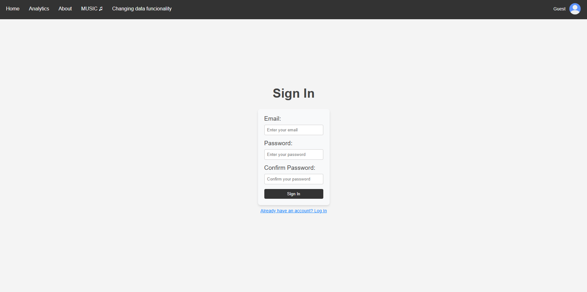
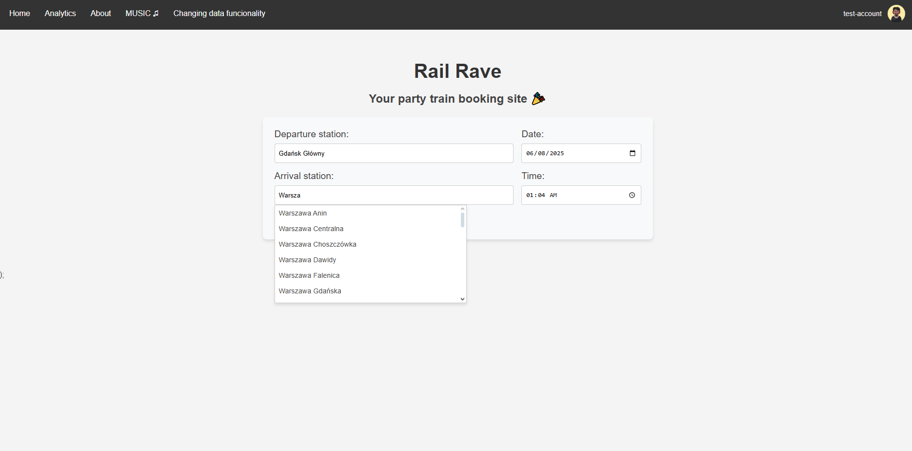
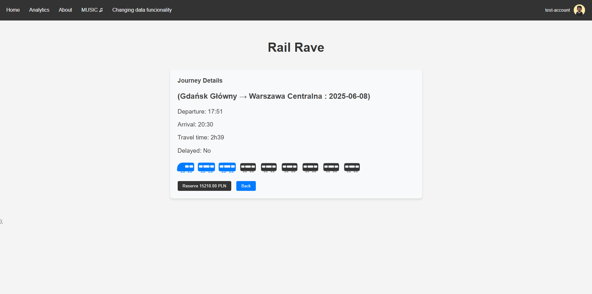
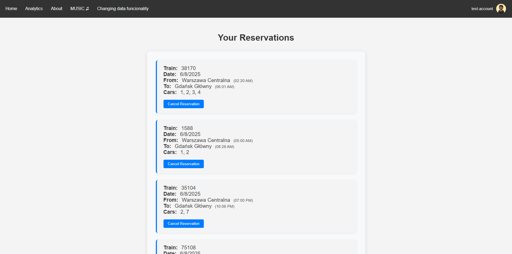
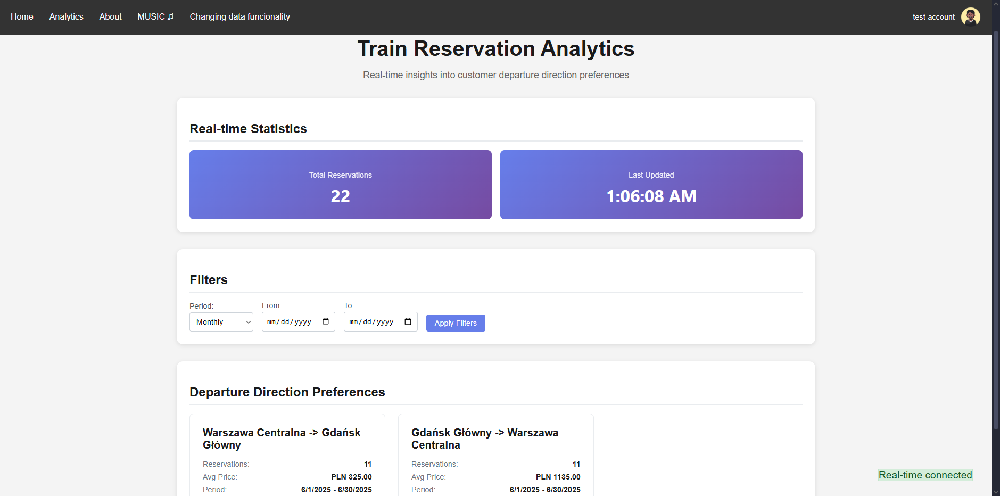
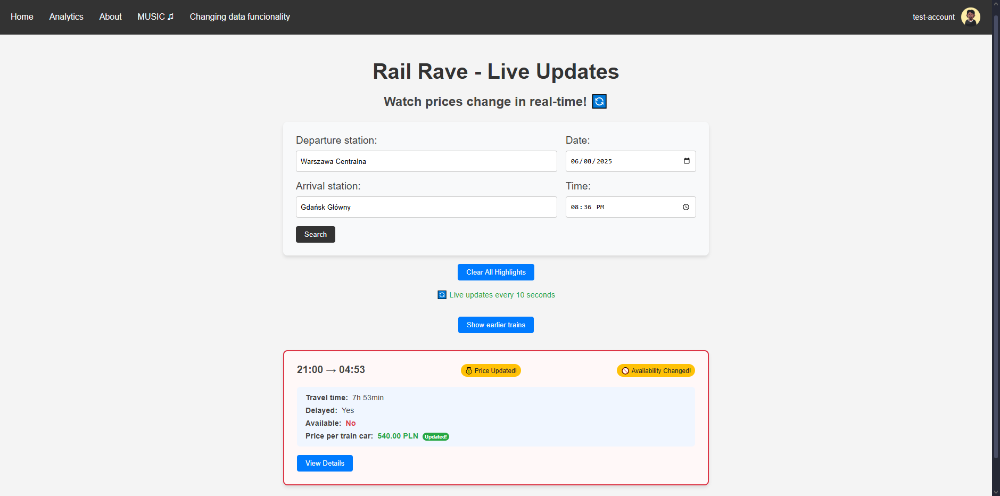

# High Availability Distributed Systems

This repository contains a comprehensive implementation of a distributed train booking system demonstrating advanced microservices architecture patterns and high availability concepts. The project showcases real-world application of CQRS, SAGA, and Event Sourcing patterns in a scalable distributed environment.

## 🎯 Project Overview

A full-stack train booking application featuring real-time updates, multi-client support, and comprehensive reservation management. The system simulates a realistic train booking experience with pre-scraped train data from major Polish railway stations and implements enterprise-grade distributed system patterns.

### Core Features
- **Real-time Train Search** - Live search across 5 major stations
- **User Account Management** - Registration, authentication, and profile management  
- **Reservation System** - Book, manage, and cancel train reservations
- **Real-time Updates** - Live updates for multiple concurrent clients
- **Analytics Dashboard** - Comprehensive booking and usage analytics
- **Change Management** - Real-time notifications for schedule changes

## 🚂 Supported Railway Stations

The system includes pre-scraped train data from Poland's major railway hubs:
- **Gdańsk Główny** - Main station in Gdańsk
- **Gdańsk Wrzeszcz** - Secondary Gdańsk station
- **Poznań Główny** - Central station in Poznań  
- **Warszawa Centralna** - Warsaw's central hub
- **Kraków Główny** - Main station in Kraków

## 🏗 Architecture Patterns

### CQRS (Command Query Responsibility Segregation)
- **Command Side:** Handles write operations (bookings, cancellations, user registration)
- **Query Side:** Optimized read models for search and analytics
- **Separation of Concerns:** Independent scaling of read/write operations

### SAGA Pattern
- **Distributed Transactions:** Manages complex booking workflows across services
- **Compensation Logic:** Automatic rollback for failed multi-step operations
- **Service Coordination:** Ensures data consistency across microservices

### Event Sourcing
- **Event Store:** Complete audit trail of all system changes
- **Event Replay:** Ability to reconstruct system state from events
- **Temporal Queries:** Historical data analysis and debugging

## 🔧 Microservices Architecture

### Frontend Service
- **Technology:** React with Vite
- **Port:** 3000 (mapped from container port 80)
- **Features:** Modern responsive UI with real-time updates
- **Docker:** Multi-stage build with Nginx serving

### Train Scraper Service
- **Technology:** Java Spring Boot
- **Port:** 8080
- **Purpose:** Web scraping service for train schedule data
- **Dependencies:** Selenium Firefox for web automation

### Account Manager Service
- **Technology:** .NET Core
- **Port:** 5220
- **Responsibilities:** User authentication, registration, profile management
- **Database:** PostgreSQL with Entity Framework

### Transaction Manager Service
- **Technology:** .NET Core
- **Port:** 5221
- **Purpose:** Booking transactions, reservation processing
- **Patterns:** SAGA orchestration, CQRS implementation
- **Database:** PostgreSQL with Entity Framework

### Changes Manager Service
- **Technology:** .NET Core
- **Port:** 5222
- **Function:** Real-time change notifications, schedule updates
- **Integration:** Event-driven communication

### Analytics Service
- **Technology:** .NET Core
- **Port:** 5223
- **Features:** Usage analytics, booking statistics, reporting
- **Real-time:** SignalR hubs for live dashboard updates

### Database Layer
- **PostgreSQL 15:** Primary data store
- **Port:** 5432
- **Features:** ACID compliance, advanced indexing, JSON support
- **Persistence:** Docker volume for data durability

## 📋 Prerequisites

### Software Requirements
- **Docker:** Version 20.0+
- **Docker Compose:** Version 3.8+
- **.NET SDK:** 6.0+ (for development)
- **Node.js:** 18+ (for frontend development)
- **Java:** 11+ (for train scraper development)

### System Requirements
- **RAM:** Minimum 8GB (16GB recommended)
- **CPU:** Multi-core processor recommended
- **Disk Space:** 10GB+ for containers and data
- **Network:** Internet access for initial image pulls

## 🚀 Quick Start

### Local Development Setup

1. **Clone the Repository**
   ```bash
   git clone <repository-url>
   cd High Availability Distributed Systems
   ```

2. **Start All Services (Local)**
   ```bash
   docker-compose up -d
   ```

3. **Verify Services Status**
   ```bash
   docker-compose ps
   ```

4. **Access the Application**
   - **Main Application:** http://localhost:3000
   - **Train Scraper API:** http://localhost:8080
   - **Account Manager API:** http://localhost:5220
   - **Transaction Manager API:** http://localhost:5221
   - **Changes Manager API:** http://localhost:5222
   - **Analytics Service API:** http://localhost:5223

### Cluster Deployment (Docker Swarm)

> **Note:** The cluster deployment configuration (`docker-compose-cluster.yml`) was specifically designed for the university department cluster environment and may not work in other environments without proper network and database setup.

The cluster deployment uses pre-built Docker images and connects to an external PostgreSQL database:

```bash
# For cluster deployment (requires proper cluster environment)
docker stack deploy -c docker-compose-cluster.yml train-booking-stack
```

**Cluster Access Points:**
- **Main Application:** http://cluster-host:18942
- **Train Scraper API:** http://cluster-host:18943
- **Account Manager API:** http://cluster-host:18944
- **Transaction Manager API:** http://cluster-host:18945
- **Analytics Service API:** http://cluster-host:18946
- **Changes Manager API:** http://cluster-host:18947

### Service Health Checks
```bash
# Check all containers are running
docker-compose logs -f

# Check individual service logs
docker-compose logs frontend
docker-compose logs train-scraper
docker-compose logs account-manager
```

## 📊 Application Screenshots

### User Authentication

*Modern authentication interface with secure login functionality*

### Train Search

*Real-time train search across multiple stations with filtering options*

### Booking Process

*Streamlined booking interface with seat selection and payment simulation*

### Reservation Management

*Comprehensive reservation management with booking history and status*

### Analytics Dashboard

*Real-time analytics with booking statistics and usage metrics*

### Change Notifications

*Real-time notification system for schedule changes and updates*

## 🌐 Production Deployment

### Docker Swarm Cluster
The project was successfully deployed on a university department cluster using Docker Swarm with the `docker-compose-cluster.yml` configuration:

- **High Availability:** Service replication across multiple nodes
- **Load Balancing:** Automatic traffic distribution  
- **Service Discovery:** Built-in container networking
- **Rolling Updates:** Zero-downtime deployments
- **External Database:** Shared PostgreSQL instance across cluster
- **Overlay Networks:** Cross-node container communication

### Deployment Configurations

#### Local Development (`docker-compose.yml`)
- **Purpose:** Local testing and development
- **Database:** Containerized PostgreSQL instance
- **Ports:** Standard development ports (3000, 8080, 5220-5223)
- **Networks:** Bridge networking for single-host deployment
- **Build:** Services built from source code

#### Cluster Production (`docker-compose-cluster.yml`)
- **Purpose:** University cluster deployment with Docker Swarm
- **Database:** External PostgreSQL database (`admin-postgres_db`)
- **Ports:** Cluster-specific ports (18942-18947) 
- **Networks:** Overlay networks for multi-host communication
- **Images:** Pre-built Docker Hub images (`matowaty/train-scraper:*`)
- **Note:** ⚠️ This configuration is tailored for the specific cluster environment and may require adjustments for other deployments

### Cluster Deployment Commands
```bash
# Initialize swarm mode (if not already done)
docker swarm init

# Deploy to cluster using cluster configuration
docker stack deploy -c docker-compose-cluster.yml train-booking-stack

# Scale services across cluster nodes
docker service scale train-booking-stack_frontend=3
docker service scale train-booking-stack_transaction-manager=2

# Monitor cluster deployment
docker stack services train-booking-stack
docker service logs train-booking-stack_frontend
```

## 🔄 Advanced Features

### Real-time Communication
- **SignalR Hubs:** Live updates for booking status
- **WebSocket Connections:** Bi-directional client-server communication
- **Event Broadcasting:** Multi-client synchronization

### Data Consistency
- **Distributed Transactions:** Two-phase commit protocols
- **Eventual Consistency:** Event-driven state synchronization
- **Conflict Resolution:** CRDT-based merge strategies

### Monitoring & Observability
- **Container Health Checks:** Automatic service recovery
- **Distributed Logging:** Centralized log aggregation
- **Performance Metrics:** Service-level monitoring

## 🛠 Development Workflow

### Local Development
```bash
# Start infrastructure services only
docker-compose up postgres selenium-firefox

# Run services individually for debugging
# (configure connection strings to use localhost)
```

### Database Management
```bash
# Access PostgreSQL directly
docker-compose exec postgres psql -U admin -d mydb

# Backup database
docker-compose exec postgres pg_dump -U admin mydb > backup.sql

# Restore database  
docker-compose exec -T postgres psql -U admin mydb < backup.sql
```

## 📈 Performance Considerations

### Scalability Features
- **Horizontal Scaling:** Independent service scaling
- **Connection Pooling:** Efficient database connections
- **Caching Strategies:** Redis integration ready
- **CDN Support:** Static asset optimization

### Resource Optimization
- **Multi-stage Builds:** Reduced container sizes
- **Health Checks:** Proactive failure detection
- **Resource Limits:** Memory and CPU constraints
- **Volume Persistence:** Data durability guarantees

## 🧪 Testing Strategy

### Integration Testing
- **API Testing:** Comprehensive endpoint validation
- **Service Communication:** Inter-service integration tests
- **Database Testing:** Data consistency verification
- **End-to-End Testing:** Complete user journey validation

### Load Testing
- **Concurrent Users:** Multi-client booking simulation
- **Stress Testing:** System breaking point analysis
- **Performance Monitoring:** Response time optimization
- **Resource Usage:** Memory and CPU profiling

## 📚 Key Technologies

### Backend Technologies
- **.NET Core 6.0:** Modern cross-platform framework
- **Entity Framework Core:** ORM with PostgreSQL
- **SignalR:** Real-time web functionality
- **MediatR:** CQRS and mediator pattern implementation

### Frontend Technologies
- **React 18:** Modern component-based UI
- **Vite:** Fast build tool and dev server
- **TypeScript:** Type-safe JavaScript development
- **TailwindCSS:** Utility-first CSS framework

### Infrastructure Technologies
- **Docker:** Containerization platform
- **PostgreSQL:** Advanced relational database
- **Selenium:** Web automation framework
- **Nginx:** High-performance web server

## 🔒 Security Features

### Authentication & Authorization
- **JWT Tokens:** Stateless authentication
- **Role-based Access:** Granular permission control
- **CORS Protection:** Cross-origin request security
- **Input Validation:** XSS and injection prevention

### Data Protection
- **Database Encryption:** At-rest data protection
- **HTTPS Enforcement:** Secure data transmission
- **SQL Injection Prevention:** Parameterized queries
- **Audit Logging:** Complete action tracking

## 🚀 Future Enhancements

### Planned Features
- **Payment Gateway Integration:** Real payment processing
- **Mobile Application:** React Native companion app
- **Machine Learning:** Demand prediction and pricing
- **Kubernetes Deployment:** Cloud-native orchestration

### Scalability Improvements
- **Event Streaming:** Apache Kafka integration
- **Microservice Mesh:** Istio service mesh
- **Distributed Caching:** Redis cluster deployment
- **API Gateway:** Centralized routing and security

## 📖 Learning Outcomes

This project demonstrates proficiency in:

### Distributed Systems Concepts
- **Microservices Architecture:** Service decomposition and communication
- **Distributed Transactions:** SAGA pattern implementation
- **Event-Driven Architecture:** Asynchronous communication
- **High Availability:** Fault tolerance and recovery

### Modern Development Practices
- **Containerization:** Docker and container orchestration
- **Infrastructure as Code:** Declarative deployment
- **API Design:** RESTful services and real-time communication
- **Database Design:** Relational modeling and optimization

### Enterprise Patterns
- **CQRS Implementation:** Command-query separation
- **Event Sourcing:** Audit trails and temporal queries
- **Domain-Driven Design:** Bounded contexts and aggregates
- **Clean Architecture:** Separation of concerns

---

## 👥 Team Members & Contributions

This project was developed collaboratively by a team of four developers:

- **[@PawelManczak](https://github.com/PawelManczak)** - Train Scraper Service
  - Java Spring Boot web scraping service
  - Selenium-based train schedule data extraction
  - Integration with Polish railway systems

- **[@matowaty](https://github.com/matowaty)** - Analytics Service & Deployment
  - .NET Core analytics and reporting service
  - Docker Swarm cluster deployment and management
  - Production environment setup and monitoring

- **[@SzramStaR](https://github.com/SzramStaR)** - Changes Manager Service
  - Real-time change notification system
  - Event-driven communication implementation
  - Schedule update and notification logic

- **[@adbreeker](https://github.com/adbreeker)** (me) - Frontend, Transaction Manager & Account Manager
  - React frontend application with real-time updates
  - .NET Core transaction processing service (SAGA pattern)
  - User authentication and account management service

Each team member contributed to the overall architecture design and integration testing, demonstrating effective collaboration in distributed system development.

**Note:** This project was developed as part of a High Availability Distributed Systems course, demonstrating practical implementation of enterprise-grade distributed system patterns in a real-world scenario. The system was successfully deployed and tested on a university cluster environment using Docker Swarm.
