# Chess Game Development: AI Model Comparison Experiment

## Experiment Overview

This experiment evaluates the performance of five different AI models in creating a complete chess game implementation based on the [Game Design Document](GDD.md). The objective was to measure how many prompts and tokens each model requires to produce a satisfying chess game from a detailed specification.

### Methodology

All models received the same initial comprehensive prompt:

> Using the Game Design Document [GDD.md](GDD.md) and your own knowledge, create a Chess game in single file Chess-{model_name}.py with use of PyGame library available in .venv.
> Make sure to include every mechanic and visual design that is described in GDD.
> 1. For initial state check especially: [Setup](GDD.md#setup), [Visuals](GDD.md#visuals) and [UI panel](GDD.md#ui-panel).
> 2. For mechanics and game flow check especially: [Rules](GDD.md#rules) and [Course of the game](GDD.md#course-of-the-game).

Subsequent prompts followed a simplified format to maintain consistency across models:
```
Fix the issues:
1. Issue nr 1
2. Issue nr 2
...
```

This simple, casual approach was chosen intentionally to minimize variable factors and provide a fair comparison of each model's ability to adapt and solve problems.

---

## Model Results

### 1. Claude Haiku 4.5

**Statistics:**
- **Prompts:** 9
- **Total Tokens:** 7,947,344
- **Model Turns:** 96
- **Tool Calls:** 107
- **Errors:** 0
- **Total Events:** 280

**Implementation:** [Chess-ClaudeHaiku.py](Games/Chess-ClaudeHaiku.py)

**Results Description:**

Despite higher statistics, Claude Haiku delivered satisfying results in both mechanics and visuals. The model demonstrated consistent responsiveness and handled pointed issues well throughout the iteration process.

**Final Look:**

| | |
|---|---|
| 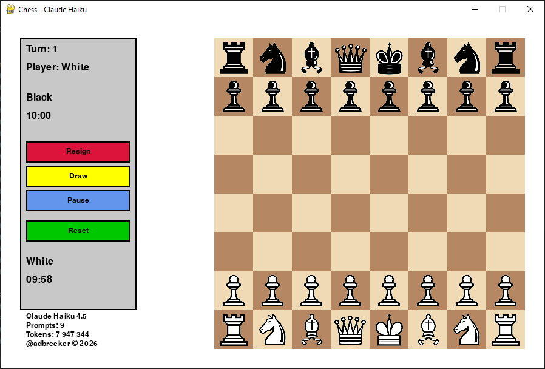 | 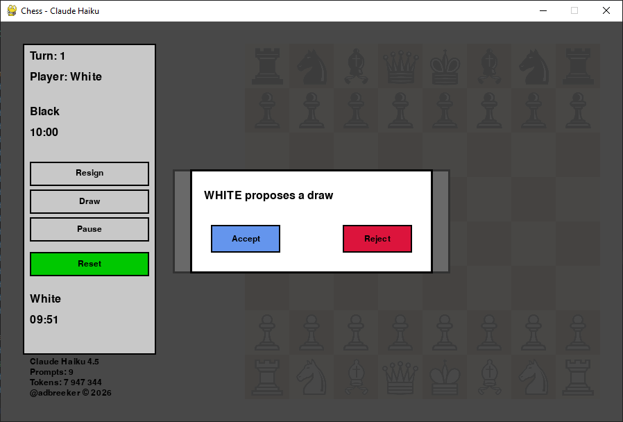 |
| 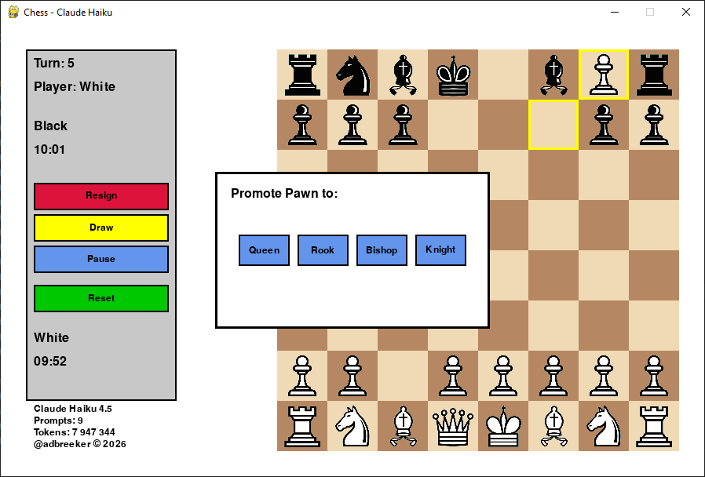 | 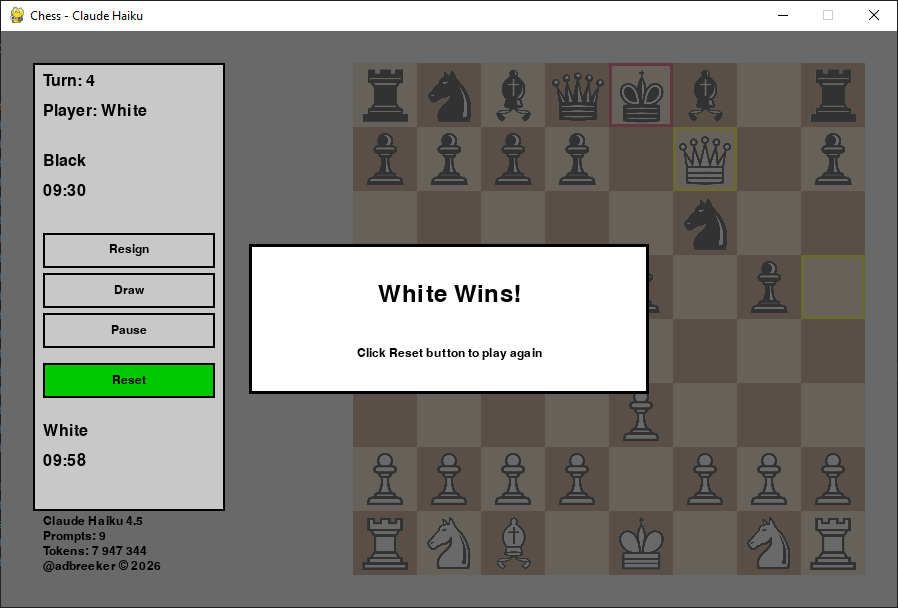 |

**Pros & Cons:**

| Aspect | Details |
|--------|---------|
| **Advantages** | • Quick and responsive execution<br>• Handled corrections well<br>• Satisfying mechanical implementation<br>• 3x cheaper than top-tier models<br>• Good visual design |
| **Disadvantages** | • Introduced several smaller bugs initially<br>• Required more prompts than optimal performers |

---

### 2. Grok Code Fast 1

**Statistics:**
- **Prompts:** 6
- **Total Tokens:** 3,430,780
- **Model Turns:** 64
- **Tool Calls:** 57
- **Errors:** 0
- **Total Events:** 157

**Implementation:** [Chess-GrokCodeFast.py](Games/Chess-GrokCodeFast.py)

**Results Description:**

Grok Code Fast quickly reached a playable state with minimal issues. However, the visual presentation is the weakest among all models tested, which is a significant concern for game development where aesthetics matter.

**Final Look:**

| | |
|---|---|
| 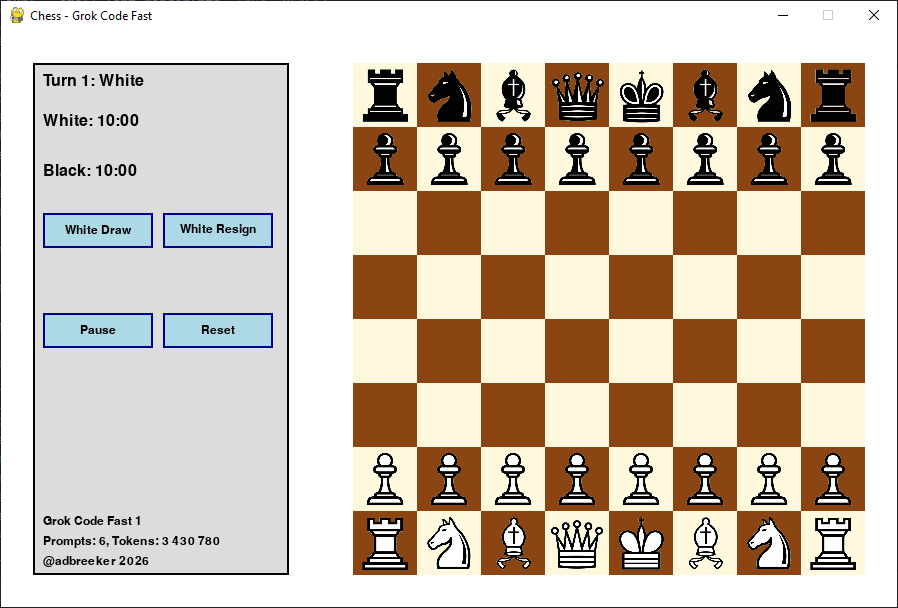 | 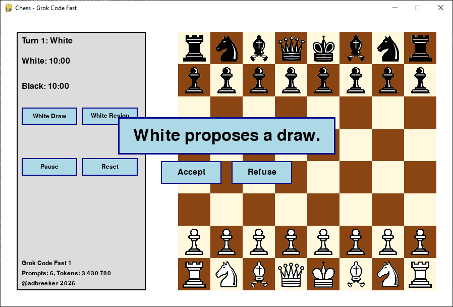 |
| 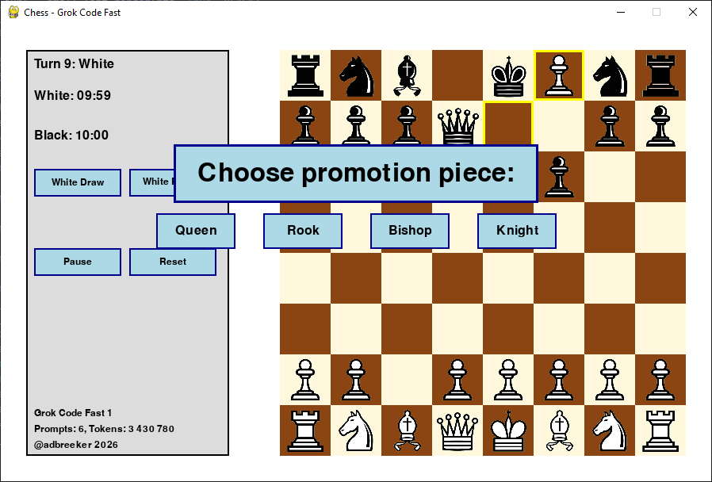 | 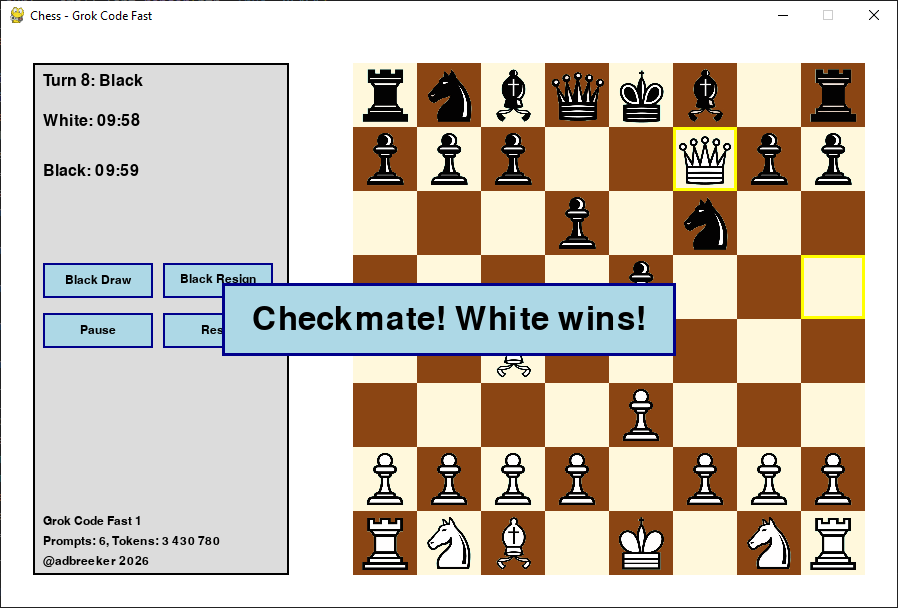 |

**Pros & Cons:**

| Aspect | Details |
|--------|---------|
| **Advantages** | • Fewest tokens among paid models<br>• Rapid path to playable state<br>• Minimal issues requiring correction<br>• Strong mechanical foundation |
| **Disadvantages** | • Poorest visual aesthetics of all models<br>• Lacks visual polish and design sense<br>• Limited range of use for visually-focused projects |

---

### 3. GPT-5.3-Codex

**Statistics:**
- **Prompts:** 2
- **Total Tokens:** 900,157
- **Model Turns:** 16
- **Tool Calls:** 19
- **Errors:** 1
- **Total Events:** 55

**Implementation:** [Chess-GPT5Codex.py](Games/Chess-GPT5Codex.py)

**Results Description:**

Despite longer processing times, GPT-5.3-Codex delivered the most impressive outcome. A single follow-up prompt addressing identified issues resulted in a complete, polished game with superior visuals and mechanics that other models didn't consider.

**Final Look:**

| | |
|---|---|
| 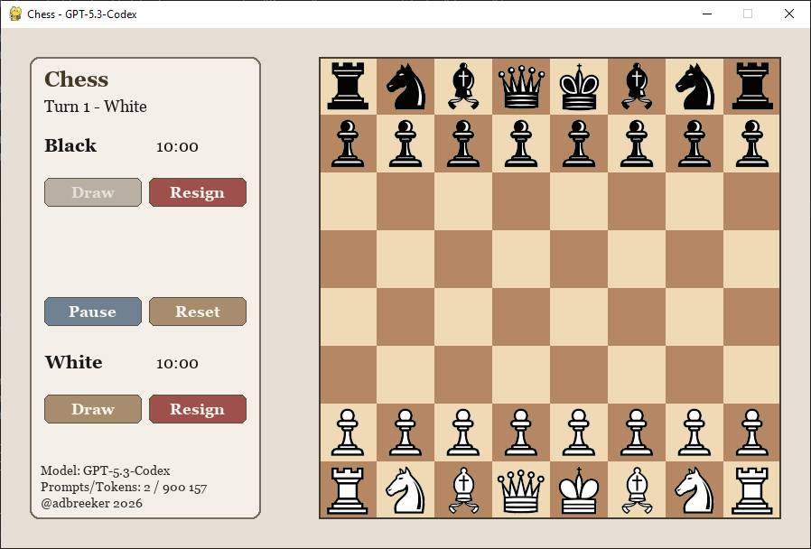 | 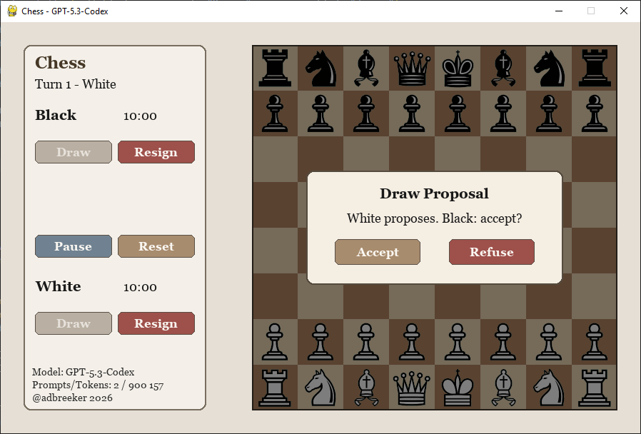 |
| 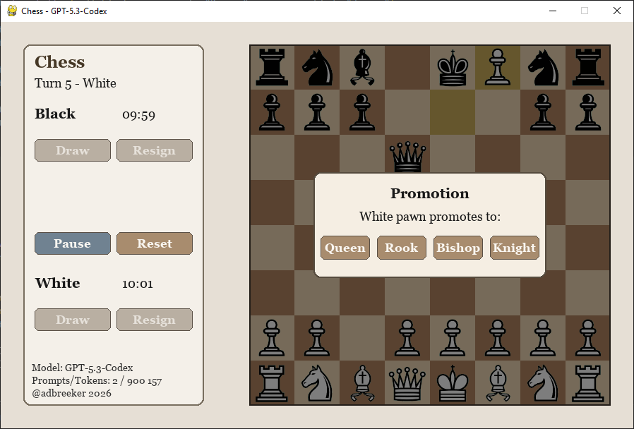 | 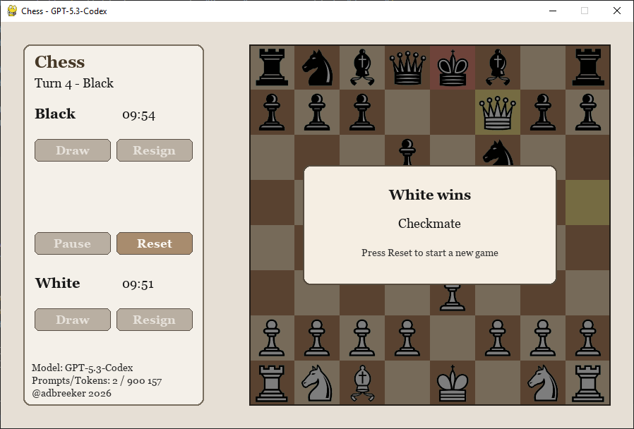 |

**Pros & Cons:**

| Aspect | Details |
|--------|---------|
| **Advantages** | • Fewest prompts required (2)<br>• Outstanding final visuals and mechanics<br>• Creative implementation features not seen in other models<br>• Minimal token usage relative to output quality<br>• Efficient problem-solving |
| **Disadvantages** | • Longer wait times per response<br>• Single error encountered during execution |

---

### 4. Gemini 3.1 Pro

**Statistics:**
- **Prompts:** 3
- **Total Tokens:** 1,123,267
- **Model Turns:** 25
- **Tool Calls:** 25
- **Errors:** 1
- **Total Events:** 68

**Implementation:** [Chess-GeminiPro.py](Games/Chess-GeminiPro.py)

**Results Description:**

Gemini faced initial challenges with VS Code tool usage and file manipulation, resorting to workarounds like requesting console commands instead of direct file editing. However, after a single corrective prompt addressing specific issues, it fixed all problems and delivered good results within acceptable parameters.

**Final Look:**

| | |
|---|---|
| 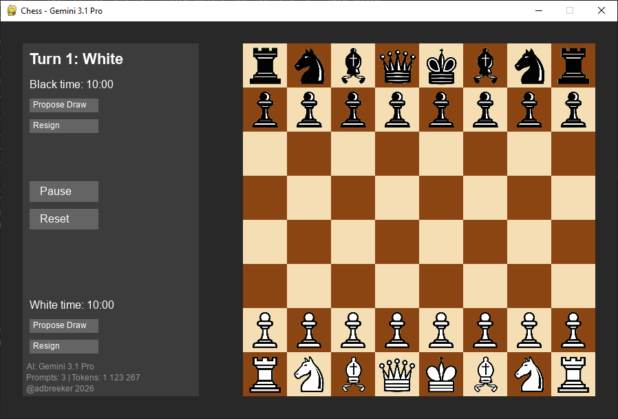 | 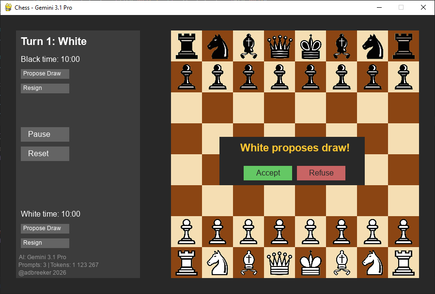 |
| 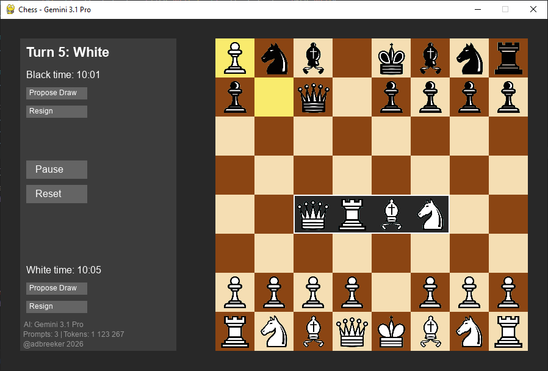 | 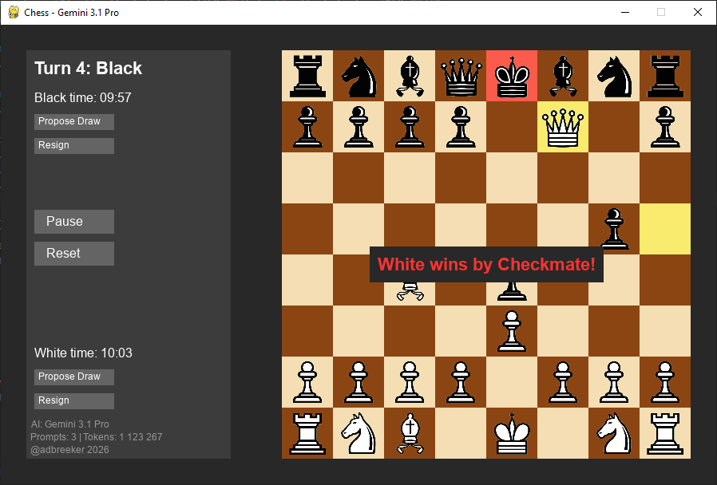 |

**Pros & Cons:**

| Aspect | Details |
|--------|---------|
| **Advantages** | • Only 3 prompts needed for satisfying result<br>• Good visual design upon correction<br>• Solid mechanical implementation<br>• Recovered well from initial setbacks |
| **Disadvantages** | • Poor initial tool usage with VS Code<br>• Attempted workarounds (shell commands, external scripts)<br>• Initial output contained severe bugs (e.g., allowing king capture)<br>• Single error during execution |

---

### 5. Raptor mini

**Statistics:**
- **Prompts:** 20+
- **Total Tokens:** 12,000,000+
- **Model Turns:** 140
- **Tool Calls:** 139
- **Errors:** 0
- **Total Events:** 415

**Status:** **EXPERIMENT ABORTED** due to lack of improvement over multiple iterations.

**Results Description:**

Raptor mini showed promise initially but encountered persistent difficulties with VS Code tools and creative problem-solving. The model struggled with general issue descriptions and could not independently complete the task, requiring increasing refinement that didn't yield proportional improvements.

*Note: Raptor's UI field spacing, arrangement, and positioning were finally refined by GPT-5.3-Codex to achieve the final polished state shown below.*

**Final Look:**

| | |
|---|---|
| 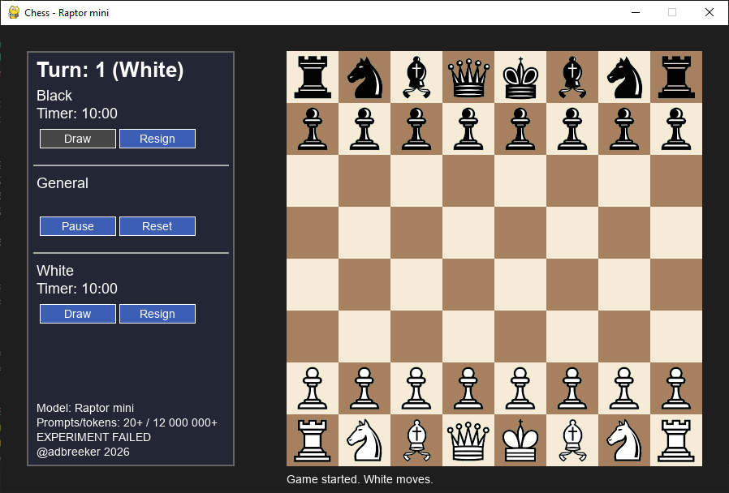 | 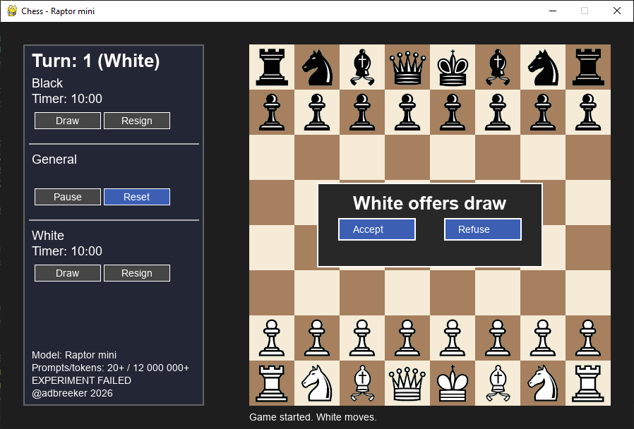 |
| 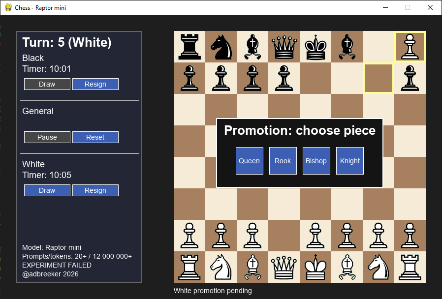 | 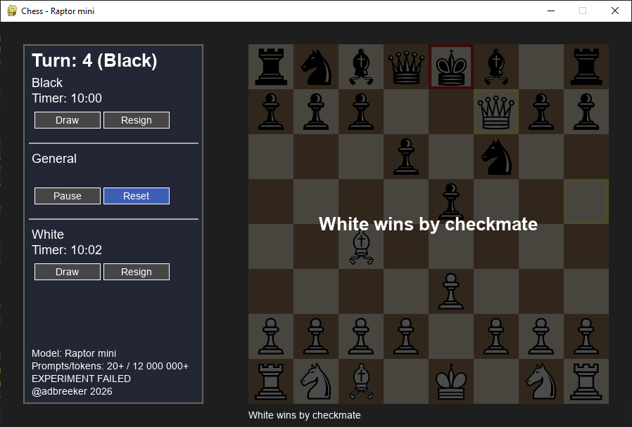 |

**Pros & Cons:**

| Aspect | Details |
|--------|---------|
| **Advantages** | • Fastest response times of all models<br>• Excellent with precise, specific requirements<br>• Free to use (no cost)<br>• Good for targeted inline completions |
| **Disadvantages** | • Requires 20+ prompts (unacceptable iteration count)<br>• Higher token usage than most paid models<br>• Poor imagination and creativity<br>• Difficulties with VS Code tool integration<br>• Gets stuck on generic issue descriptions<br>• Cannot autonomously complete complex tasks |

---

## Subjective Model Ranking

### S-Tier
**GPT-5.3-Codex**
- Delivered the best overall result with only 2 prompts
- Outstanding visual and mechanical implementation
- Creative features not conceived by other models
- Most efficient token-to-quality ratio
- Despite long response times, the outcome justifies the investment

### A-Tier
**Gemini 3.1 Pro**
- Recovered well from initial struggles with only 1 corrective prompt (3 prompts in total)
- Final result is very good with proper visuals
- Mechanical soundness achieved quickly
- Tool usage improved after guidance
- Cost-effective with minimal prompts needed

**Claude Haiku 4.5**
- Consistently responsive and reliable
- 3x cheaper than top models while delivering comparable quality
- Good balance of speed, cost, and mechanical/visual quality
- Handles corrections well
- Ideal for iterative development

### B-Tier
**Raptor mini**
- Free to use (significant advantage for budget-constrained projects)
- Excellent for precise, specific tasks and inline completions
- Fastest response times
- Poor performance on creative, open-ended tasks
- Not suitable for complex autonomous implementations

**Grok Code Fast 1**
- Weak visual aesthetics (significant drawback for game development)
- Quickly reaches playable state but lacks polish
- Limited practical application for projects requiring visual quality
- Otherwise competent at mechanical implementation

---

## Overall Assessment

| Model | Recommendation | Best For |
|-------|-----------------|----------|
| **GPT-5.3-Codex** | ⭐⭐⭐⭐⭐ | Complex creative tasks, visual applications, high-quality outputs |
| **Gemini 3.1 Pro** | ⭐⭐⭐⭐ | Balanced productivity, good quality, reasonable cost |
| **Claude Haiku 4.5** | ⭐⭐⭐⭐ | Cost-effective iteration, responsive feedback loops |
| **Raptor mini** | ⭐⭐⭐ | Precise tasks, inline completions, budget projects |
| **Grok Code Fast 1** | ⭐⭐⭐ | Baseline functionality only, not recommended for game development |

---

## Project Context

This experiment is part of a larger **Information Society Technologies** research initiative focused on:
- **Rating model energy efficiency** for various development tasks
- **Analyzing cost-performance ratios** across different AI models
- **Evaluating practical suitability** for game development workflows
- **Comparing token usage** and token-per-output-quality metrics

The findings from this chess game experiment will contribute to comprehensive guidelines for selecting appropriate AI models for game development and other software engineering tasks, considering both monetary costs and environmental impact.

---

## Files Reference

- **[GDD.md](GDD.md)** - Complete Game Design Document
- **[Chess-ClaudeHaiku.py](Games/Chess-ClaudeHaiku.py)** - Claude Haiku 4.5 implementation
- **[Chess-GrokCodeFast.py](Games/Chess-GrokCodeFast.py)** - Grok Code Fast 1 implementation
- **[Chess-GPT5Codex.py](Games/Chess-GPT5Codex.py)** - GPT-5.3-Codex implementation
- **[Chess-GeminiPro.py](Games/Chess-GeminiPro.py)** - Gemini 3.1 Pro implementation

