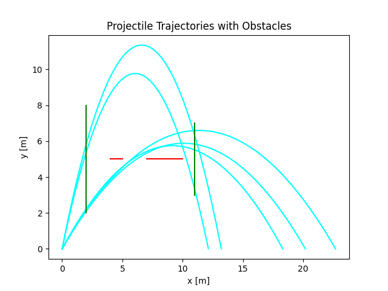
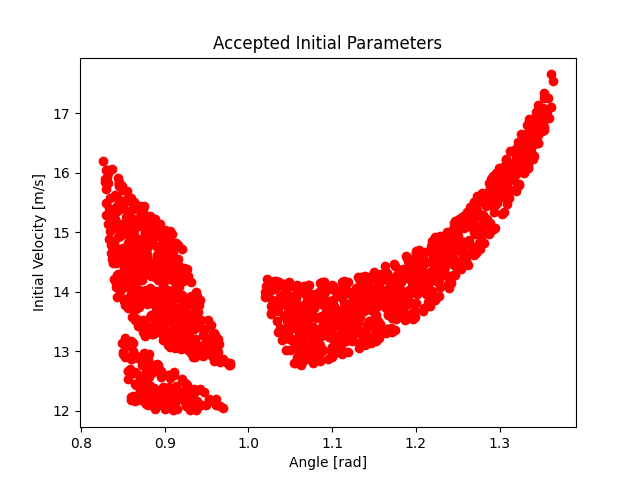
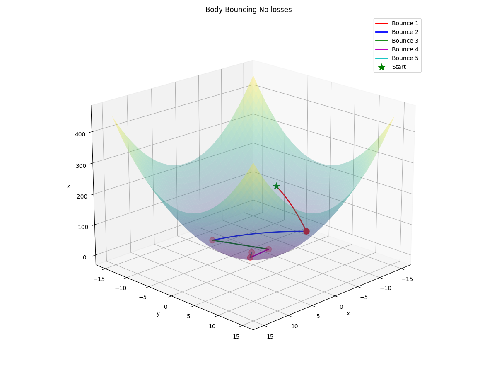
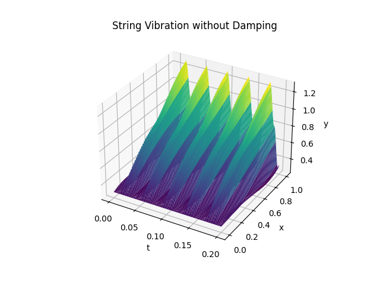
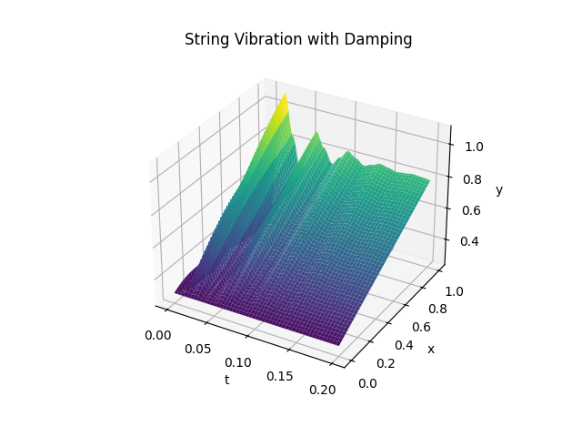
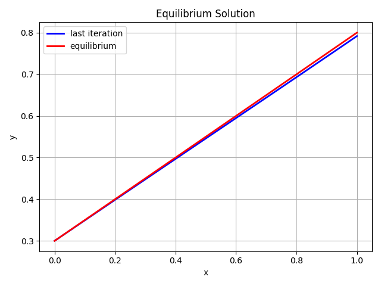
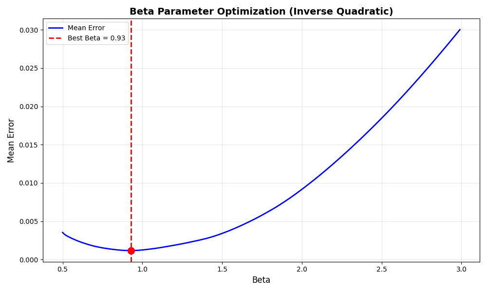
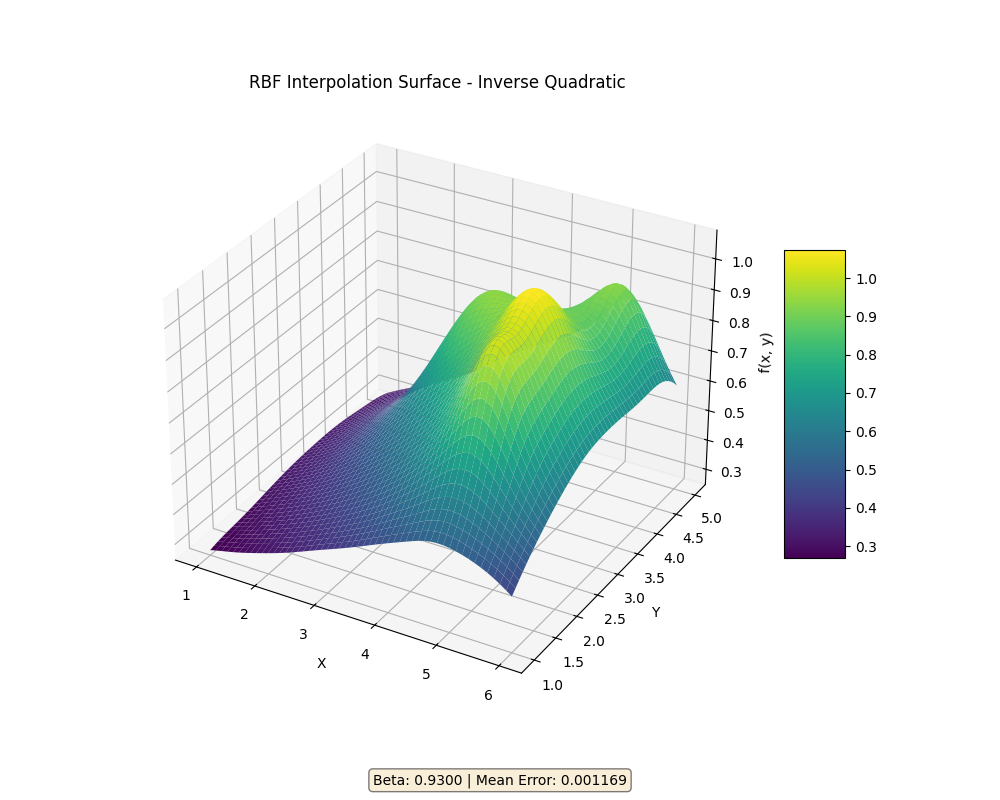

# Modeling and Simulation of Systems

This repository contains four laboratory projects focused on numerical modeling, simulation, and visualization of physical and approximation systems in Python.

The labs cover:
- projectile motion with obstacle constraints,
- body dynamics with elastic and inelastic reflections,
- numerical solution of the wave equation,
- radial basis function interpolation and parameter tuning.

## 📁 Project Contents

- `Lab1.py` - projectile motion in a uniform gravitational field.
- `Lab2.py` - bouncing body on a curved surface.
- `Lab3.py` - string vibration from the wave equation.
- `Lab4.py` - RBF interpolation on sampled surface data.
- `Tasks/` - assignment sheets (`Lab1.pdf` ... `Lab4.pdf`).
- `Resources/` - generated plots and lab data (`surface.mat`).

## 🧰 Requirements

Dependencies listed in `requirements.txt`:
- numpy
- matplotlib
- scipy

Install:

```bash
pip install -r requirements.txt
```

## ▶️ How To Run

Run any lab script from the project root:

```bash
python Lab1.py
python Lab2.py
python Lab3.py
python Lab4.py
```

Each script saves figures into the matching folder inside `Resources/`.

## 🧪 Lab 1 - Projectile Motion With Obstacles

`Lab1.py` performs a Monte Carlo search over initial angle and velocity for projectile trajectories in a gravitational field.

Main points:
- Uses random initial parameters (`N = 100000`).
- Applies geometric constraints from four obstacles.
- Keeps only trajectories that satisfy all obstacle conditions.
- Visualizes accepted trajectories and accepted parameter region.

### 🖼️ Generated Figures





## 🧪 Lab 2 - Body Bouncing On A Surface

`Lab2.py` simulates a body moving under gravity and bouncing on the surface:

z = x^2 + y^2

Main points:
- Computes impact time analytically for each bounce.
- Uses surface normal for reflection direction.
- Supports energy-preserving and energy-loss variants through coefficient `k`.
- Tracks kinetic, potential, and total energy per bounce.

### 🖼️ Generated Figures




## 🧪 Lab 3 - Wave Equation And String Vibration

`Lab3.py` solves a 1D wave equation numerically with finite differences.

Main points:
- Simulates both undamped and damped motion.
- Uses mixed boundary conditions (Dirichlet and Neumann).
- Compares long-time numerical state with equilibrium solution.
- Produces 3D surface plots over space and time.

### 🖼️ Generated Figures







## 🧪 Lab 4 - Radial Basis Function Interpolation

`Lab4.py` builds an interpolation model for scattered 2D data using RBFs (inverse quadratic kernel).

Main points:
- Loads training and validation sets from `Resources/Lab4/surface.mat`.
- Solves the interpolation system for RBF coefficients.
- Evaluates prediction error on validation data.
- Uses beta parameter search to find a low-error model.

### 🖼️ Generated Figures





## 📝 Notes

- Scripts are written as standalone lab exercises.
- Plot generation and console output are both part of the expected results.
- Task PDFs in `Tasks/` describe the original lab requirements.
