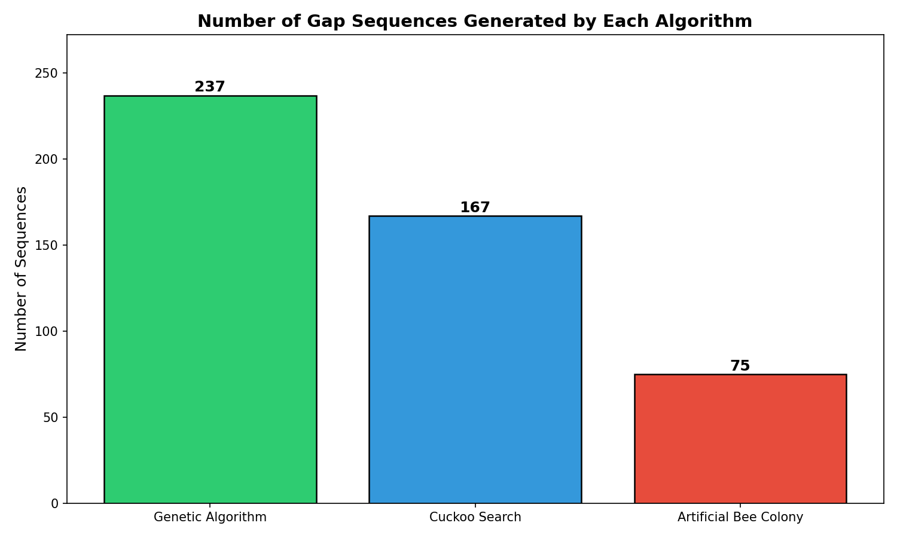
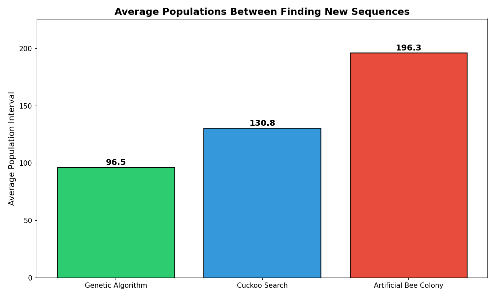
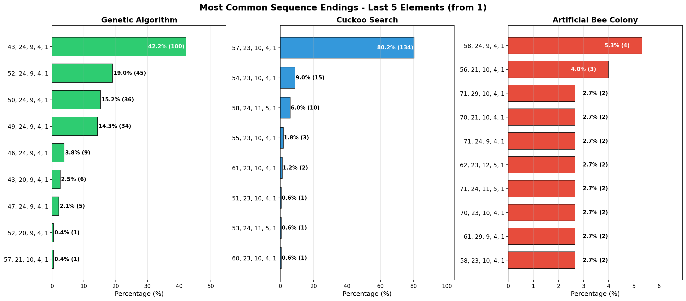
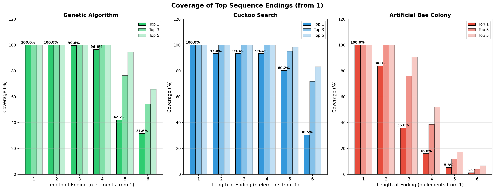

# Nature-Based Optimization Algorithms for Shellsort Gap Sequence Discovery

## Experiment Report

**Subject:** Team Strategies  
**Date:** January 2026  
**Sorting Range:** N = 2500  
**Runtime:** around 7 hours (manually stopped)

---

## 1. Problem Description

### 1.1 Objective
The goal of this experiment is to discover candidate gap sequences for Shellsort that can compete with or outperform currently known best sequences, specifically:
- **Tokuda** sequence  
- **Ciura** sequence
- **Lee** sequence
- **Skean, Ehrenborg, Jaromczyk (SEJ)** sequence

A "candidate" sequence is defined as one that wins in average of T = 100 trials against these known sequences in terms of operation count for sorting arrays of size N = 2500.

### 1.2 Objective Function
The fitness function measures the average **count of comparison and swap operations** during sorting. This metric is computationally expensive to evaluate (requires many additional sortings performed), creating significant overhead when assessments are required during population generation phases.

### 1.3 Experimental Setup
- **Initial Population:** 100 sequences
  - 4 known sequences (Tokuda, Ciura, Lee, SEJ)
  - 96 semi-randomly generated sequences
- **Execution:** Three algorithms running in parallel in an endless search loop
- **Selection Process:** Each generation, all sequences are assessed, compared, and ranked from most to least promising before generating the next population

---

## 2. Algorithm Implementations

### 2.1 Genetic Algorithm (Modified)
| Component | Proportion |
|-----------|------------|
| Survivors (elite) | 10% |
| Children (crossover) | 50% |
| Random | 40% |
| Mutation rate | 10% (applied to children or survivors) |

**Modification:** Small survival rate of parents and large rate of new random sequences in comparison to the most classic version of the algorithm. Crossover is performed by mixing the first half of the parent sequence x with the second half of the parent sequence y. This is actually the second version of the algorithm (the first had 50% children + 50% random, with no survivors nor mutations) – it is achieving much better exploitation but at the cost of exploration (surviving parents lead to quick reduction of unique genes).

**Notes:** It might be beneficial to go back to the previous version without surviving parents (but leave mutation as is), or to control their lifespan in generations (currently, the best parents are able to live through all generations).

### 2.2 Cuckoo Search (Modified)
| Component | Proportion |
|-----------|------------|
| Survivors | 50% |
| Lévy-generated nests | 25% |
| Random nests | 25% |

**Parameters:**
- Step size: 1% of current gap value (potentially too small)
- β = 1.5

**Modification:** Instead of comparing new Lévy nests with random ones, the best 50% of nests survive, worst 25% are abandoned and randomly regenerated, and remaining 25% are replaced with Lévy nests. This removes the overhead of objective assessment during population creation.

### 2.3 Artificial Bee Colony (Classic)
Standard implementation with three phases:
1. **Employed bee phase** - neighborhood search
2. **Onlooker bee phase** - probability-based selection
3. **Scout bee phase** - random replacement after an abandonment limit of 20 trials

**Note:** This algorithm has significant overhead due to multiple objective function evaluations during population generation.

---

## 3. Results

### 3.1 Sequence Generation Performance

| Metric | Genetic Algorithm | Cuckoo Search | Artificial Bee Colony |
|--------|-------------------|---------------|----------------------|
| **Sequences Generated** | 237 | 167 | 75 |
| **Avg. Generations Between Discoveries** | 96.5 | 130.8 | 196.3 |
| **Sequence Length** | 8 elements | 9 elements | 10 elements |

*Figure 1: Total number of candidate sequences discovered by each algorithm*

*Figure 2: Average number of generations between finding new candidate sequences*

### 3.2 Sequence Statistics

#### Genetic Algorithm
| Position | Min | Average | Max |
|----------|-----|---------|-----|
| 1 | 1482 | 1665.0 | 1939 |
| 2 | 286 | 342.3 | 468 |
| 3 | 118 | 130.3 | 153 |
| 4 | 43 | 46.9 | 57 |
| 5 | 20 | 23.9 | 24 |
| 6 | 9 | 9.0 | 10 |
| 7 | 4 | 4.0 | 4 |
| 8 | 1 | 1.0 | 1 |

#### Cuckoo Search
| Position | Min | Average | Max |
|----------|-----|---------|-----|
| 1 | 2081 | 2332.8 | 2642 |
| 2 | 659 | 858.3 | 1019 |
| 3 | 256 | 303.5 | 323 |
| 4 | 116 | 132.5 | 136 |
| 5 | 51 | 56.8 | 61 |
| 6 | 23 | 23.1 | 24 |
| 7 | 10 | 10.1 | 11 |
| 8 | 4 | 4.1 | 5 |
| 9 | 1 | 1.0 | 1 |

#### Artificial Bee Colony
| Position | Min | Average | Max |
|----------|-----|---------|-----|
| 1 | 555 | 1699.6 | 6172 |
| 2 | 180 | 831.2 | 6336 |
| 3 | 77 | 233.0 | 2580 |
| 4 | 28 | 161.7 | 6095 |
| 5 | 12 | 34.0 | 146 |
| 6 | 5 | 13.8 | 61 |
| 7 | 1 | 5.6 | 20 |
| 8 | 1 | 1.8 | 9 |
| 9 | 1 | 1.2 | 4 |
| 10 | 1 | 1.0 | 1 |

### 3.3 Convergence Analysis (Sequence Endings from 1)

This analysis examines how consistently each algorithm converges to specific sequence patterns, counting from the smallest gap (1) upward.

#### Last 4 Elements Pattern Convergence

| Algorithm | Top Pattern | Coverage |
|-----------|-------------|----------|
| Genetic | [24, 9, 4, 1] | **96.6%** |
| Cuckoo | [23, 10, 4, 1] | **93.4%** |
| ABC | [24, 9, 4, 1] | 16.0% |

#### Last 5 Elements Pattern Convergence

| Algorithm | Top Pattern | Coverage |
|-----------|-------------|----------|
| Genetic | [43, 24, 9, 4, 1] | **42.2%** |
| Cuckoo | [57, 23, 10, 4, 1] | **80.2%** |
| ABC | [58, 24, 9, 4, 1] | 5.3% |

#### Last 6 Elements Pattern Convergence

| Algorithm | Top Pattern | Coverage |
|-----------|-------------|----------|
| Genetic | [127, 43, 24, 9, 4, 1] | 31.6% |
| Cuckoo | [133, 57, 23, 10, 4, 1] | 30.5% |
| ABC | Various patterns | ~1.3% each |

*Figure 3: Most common 5-element sequence endings showing convergence patterns*

*Figure 4: Coverage of top sequence endings across different lengths*

---

## 4. Analysis and Conclusions

### 4.1 Genetic Algorithm
**Strengths:**
- Fastest sequence generation (237 sequences, ~1 every 97 generations)
- Strong exploitation capabilities
- Quick convergence to competitive solutions

**Weaknesses:**
- Rapid convergence to local optima (often converging to known Ciura or SEJ sequences)
- After initial convergence, nearly all new solutions come from mutations
- Limited exploration, especially for smaller increments
- 96.6% of sequences share the same [24, 9, 4, 1] ending pattern

**Verdict:** Excellent for exploitation but poor diversity in solutions.

### 4.2 Cuckoo Search
**Strengths:**
- Good balance between speed (167 sequences) and solution quality
- Efficient population generation (no objective assessment overhead)
- Lévy flights produce compact, coherent results
- Strong convergence patterns while maintaining some diversity

**Weaknesses:**
- Still tends toward local optima
- Current step size (1% of gap) may be too conservative
- Difficult to tune step size to balance small increment precision with exploration

**Verdict:** Best middle ground; shows promise for parameter optimization.

### 4.3 Artificial Bee Colony
**Strengths:**
- **Best exploration** of the search space
- Discovers diverse sequence beginnings (only 16% convergence on top-4 pattern vs 96% for Genetic)
- Produces sequences with wider variance (Min: 555-6172 for first position)
- Only algorithm with significant pattern diversity in smaller increments

**Weaknesses:**
- Slowest sequence generation (75 sequences, ~1 every 196 generations)
- Expensive objective function evaluations during employed and onlooker phases
- Computational overhead may not justify exploration benefits

**Verdict:** Excellent exploration but too slow for practical use in its current form.

### 4.4 Key Findings

| Criterion | Winner | Notes |
|-----------|--------|-------|
| **Speed** | Genetic Algorithm | 3.2× faster than ABC |
| **Exploration** | Artificial Bee Colony | Only 16% vs 96% top-pattern convergence |
| **Balance** | Cuckoo Search | Good speed with reasonable diversity |
| **Convergence Quality** | Cuckoo Search | 80.2% convergence on a single 5-element pattern |

### 4.5 Recommendations for Future Research

1. **Cuckoo Search Optimization:** Primary focus should be on tuning meta-parameters (step size, β) to improve exploration while maintaining speed. The current 1% step size may need adjustment based on gap magnitude.

2. **Hybrid Approach:** Consider combining ABC's exploration capabilities with Genetic/Cuckoo exploitation:
   - Use ABC for initial diverse population seeding
   - Switch to Genetic or Cuckoo for refinement

3. **ABC Optimization:** If Cuckoo optimization proves unsuccessful, investigate reducing ABC's objective function calls through:
   - Lazy evaluation strategies
   - Approximate fitness caching
   - Reduced onlooker phase iterations

4. **Parameter Adaptation:** Implement adaptive step sizes for Cuckoo Search that scale appropriately for different gap magnitudes.

---

## 5. Files Reference

Project was realised as part of my master thesis regarding experimental search of gap seqeuences for Shellsort. All the source code available in the repository below (backup files linked here from reseach repository to ensure that this report remains valid even after future development of the reseach).  
**Repository:** [ShellsortResearch](https://github.com/adbreeker/ShellsortResearch)

### Project Important Scripts
| File | Description |
|------|-------------|
| [GeneticAlgorithm.hpp](https://github.com/adbreeker/Studies-PG-Public/blob/main/Team%20Strategies/Scripts/GeneticAlgorithm.hpp) | c++ implementation of Genetic Algorithm |
| [CuckooSearch.hpp](https://github.com/adbreeker/Studies-PG-Public/blob/main/Team%20Strategies/Scripts/CuckooSearch.hpp) | c++ implementation of Cuckoo Search |
| [ArtificialBeeColony.hpp](https://github.com/adbreeker/Studies-PG-Public/blob/main/Team%20Strategies/Scripts/ArtificialBeeColony.hpp) | c++ implemnetation of Artifical Bee Colony |
| [SearchingAlgorithmAnalysis.py](https://github.com/adbreeker/Studies-PG-Public/blob/main/Team%20Strategies/Scripts/SearchingAlgorithmAnalysis.py) | Python script for analyzing gap sequences outputs from every tested algorithm |

### Input Data (Raw Sequences)
| File | Description |
|------|-------------|
| [BestGapsSequences2500_genetic.txt](https://github.com/adbreeker/Studies-PG-Public/blob/main/Team%20Strategies/Sequences/BestGapsSequences2500_genetic.txt) | Raw sequences from Genetic Algorithm |
| [BestGapsSequences2500_cuckoo.txt](https://github.com/adbreeker/Studies-PG-Public/blob/main/Team%20Strategies/Sequences/BestGapsSequences2500_cuckoo.txt) | Raw sequences from Cuckoo Search |
| [BestGapsSequences2500_abc.txt](https://github.com/adbreeker/Studies-PG-Public/blob/main/Team%20Strategies/Sequences/BestGapsSequences2500_abc.txt) | Raw sequences from Artificial Bee Colony |

### Analysis Results
| File | Description |
|------|-------------|
| [analysis_genetic.txt](https://github.com/adbreeker/Studies-PG-Public/blob/main/Team%20Strategies/Results/analysis_genetic.txt) | Complete statistics for Genetic Algorithm |
| [analysis_cuckoo.txt](https://github.com/adbreeker/Studies-PG-Public/blob/main/Team%20Strategies/Results/analysis_cuckoo.txt) | Complete statistics for Cuckoo Search |
| [analysis_abc.txt](https://github.com/adbreeker/Studies-PG-Public/blob/main/Team%20Strategies/Results/analysis_abc.txt) | Complete statistics for Artificial Bee Colony |

### Plots
| File | Description |
|------|-------------|
| [plot1_num_sequences.png](https://github.com/adbreeker/Studies-PG-Public/blob/main/Team%20Strategies/Results/plot1_num_sequences.png) | Comparison of sequences generated |
| [plot2_avg_interval.png](https://github.com/adbreeker/Studies-PG-Public/blob/main/Team%20Strategies/Results/plot2_avg_interval.png) | Average generation intervals |
| [plot4_endings_length_1.png](https://github.com/adbreeker/Studies-PG-Public/blob/main/Team%20Strategies/Results/plot4_endings_length_1.png) | Ending patterns - 1 element |
| [plot4_endings_length_2.png](https://github.com/adbreeker/Studies-PG-Public/blob/main/Team%20Strategies/Results/plot4_endings_length_2.png) | Ending patterns - 2 elements |
| [plot4_endings_length_3.png](https://github.com/adbreeker/Studies-PG-Public/blob/main/Team%20Strategies/Results/plot4_endings_length_3.png) | Ending patterns - 3 elements |
| [plot4_endings_length_4.png](https://github.com/adbreeker/Studies-PG-Public/blob/main/Team%20Strategies/Results/plot4_endings_length_4.png) | Ending patterns - 4 elements |
| [plot4_endings_length_5.png](https://github.com/adbreeker/Studies-PG-Public/blob/main/Team%20Strategies/Results/plot4_endings_length_5.png) | Ending patterns - 5 elements |
| [plot4_endings_length_6.png](https://github.com/adbreeker/Studies-PG-Public/blob/main/Team%20Strategies/Results/plot4_endings_length_6.png) | Ending patterns - 6 elements |
| [plot4_endings_coverage.png](https://github.com/adbreeker/Studies-PG-Public/blob/main/Team%20Strategies/Results/plot4_endings_coverage.png) | Summary coverage plot |

---

**Note:** *The final version of this report was coherently and clearly formatted from my own notes on the results by an AI model. The AI also assisted in plotting the statistics achieved as a result of my own implementations of solution space search algorithms (genetic, cuckoo, abc). I have reviewed the final report and stand by its content; however, at the instructor’s request, I can rewrite it into a fully human, albeit less readable, version.*
